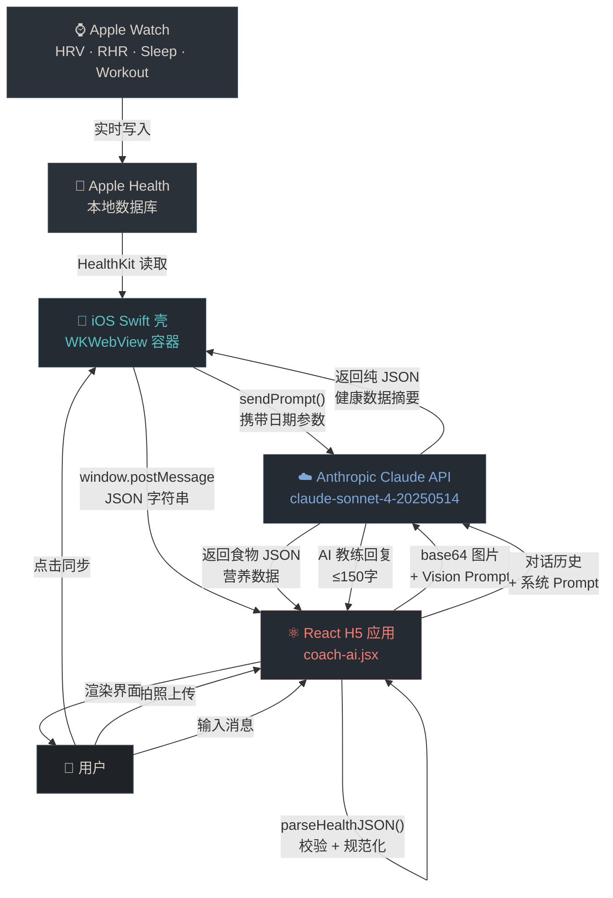
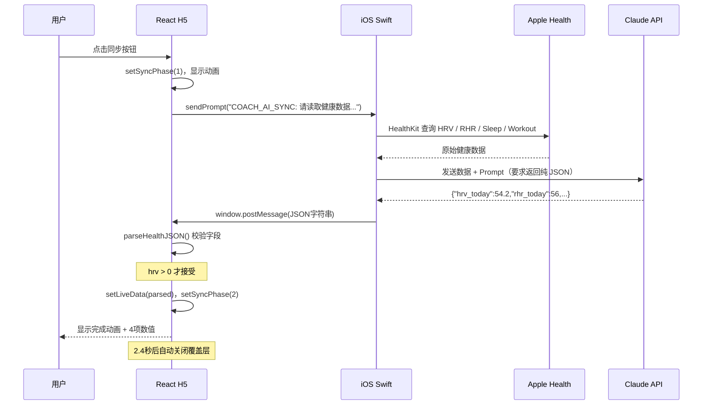
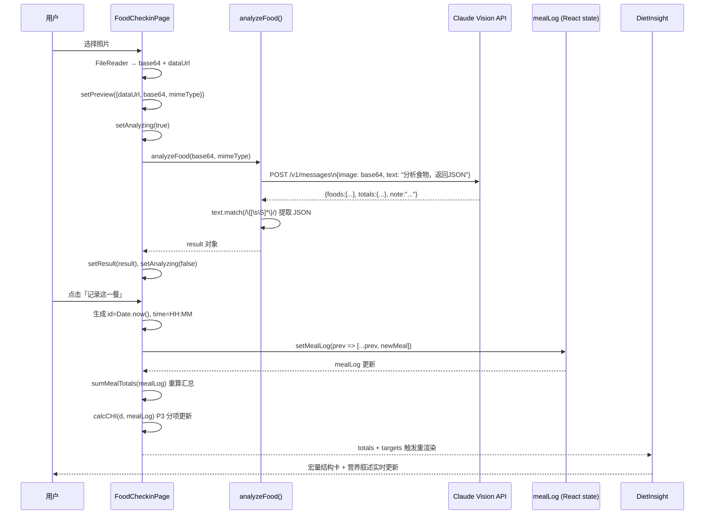
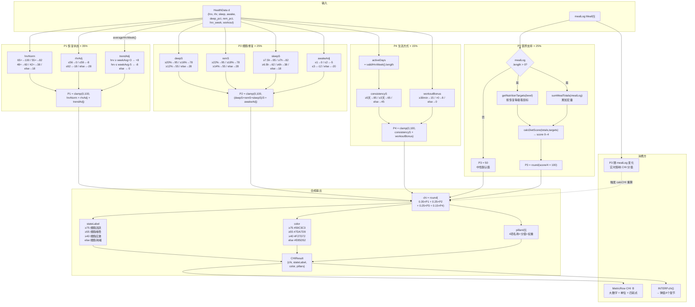
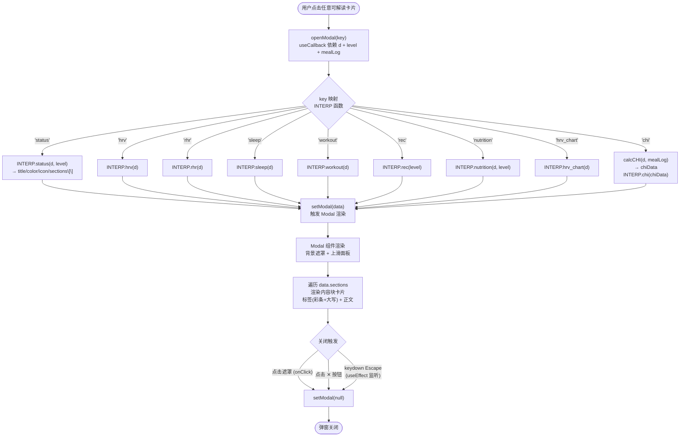
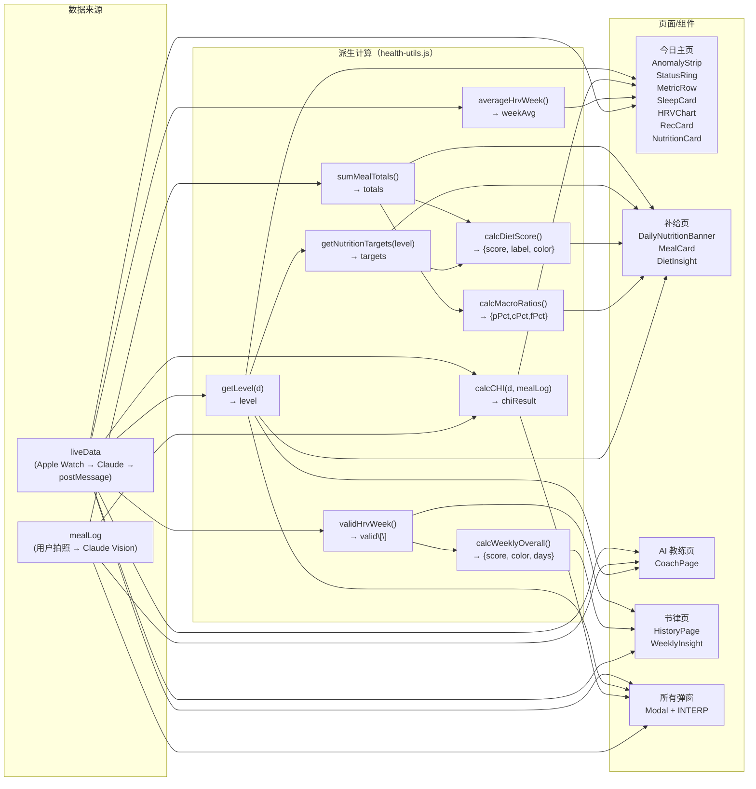

# Coach.AI 产品说明文档

**版本：** v1.0 · 2025年5月  
**主题：** Body State OS — 细胞智能健康操作系统  
**维护：** 本文档随产品迭代持续更新，以 `design/` 目录为准

---

## 目录

1. [产品定位与核心理念](#01-产品定位与核心理念)
2. [技术架构](#02-技术架构)
3. [数据结构定义](#03-数据结构定义)
4. [健康状态计算逻辑](#04-健康状态计算逻辑)
5. [界面结构与导航](#05-界面结构与导航)
6. [各页面详细说明](#06-各页面详细说明)
7. [数据同步动画流程](#07-数据同步动画流程)
8. [AI 食物识别流程](#08-ai-食物识别流程)
9. [VI 设计系统](#09-vi-设计系统)
10. [典型用户工作流程](#10-典型用户工作流程)
11. [解读内容库（INTERP）](#11-解读内容库interp)
12. [工具函数模块（health-utils.js）](#12-工具函数模块health-utilsjs)
13. [版本记录](#13-版本记录)

---

## 01 产品定位与核心理念

### 1.1 产品定义

Coach.AI（教练.AI）是一款基于 AI 的个人身体状态操作系统（Body State OS），运行于 iOS WKWebView 内嵌 H5 页面，核心功能包括：

- 通过 Apple Watch 读取每日健康数据（HRV、静息心率、睡眠、训练）
- 基于 Claude AI 进行个性化解读、对话教练与饮食营养分析
- 计算细胞健康评分（CHI），综合呈现身体整体状态
- 指导用户在正确的时机做正确的事情——训练、休息、补充营养

### 1.2 产品灵魂

Coach.AI 不是数据仪表盘，而是一位懂你身体的教练。它遵循**反仪表盘**哲学——不把所有数据平铺展示，而是用三层渐进式揭示模型引导用户：

| 层级 | 名称 | 用户体验 | 对应界面 |
|------|------|----------|----------|
| 第一层 | 感受层 | 今天身体感觉怎么样？ | 状态主环 + 异常警告条 |
| 第二层 | 理解层 | 为什么是这个状态？ | 点击解读弹窗（各指标详解）|
| 第三层 | 行动层 | 今天我该怎么做？ | 训练建议卡 + 营养卡 + AI 对话 |

### 1.3 核心关注领域

产品聚焦于细胞水平的健康管理，帮助用户逐步改善顽固性健康问题：

- 体重管理与代谢改善
- 睡眠质量优化（深睡比例、REM 占比、觉醒次数）
- 慢性炎症与疼痛（通过营养指导抗炎）
- 心血管健康（HRV 趋势、静息心率基线）
- 激素与生殖健康（长期 HRV 均值趋势）

---

## 02 技术架构

### 2.1 整体架构

| 层级 | 技术 | 说明 |
|------|------|------|
| 前端 H5 | React 18 + Vite + JSX | 单文件组件，内联样式，无 CSS 文件依赖 |
| iOS 壳 | Swift + WKWebView | 原生容器加载 H5，提供 Apple Health 数据访问 |
| AI 服务 | Anthropic Claude API | `claude-sonnet-4-20250514`，用于对话教练和食物识别 |
| 数据计算 | `health-utils.js`（纯函数）| 全部计算逻辑独立模块，100% 单元测试覆盖 |
| 图标 | 内联 SVG（`SVG_ICONS`）| 不依赖字体文件，离线可用，WebView 兼容 |
| 字体 | DM Sans（Google Fonts）| 优雅运动感，fallback 为系统 sans-serif |

### 2.2 数据流向

```
Apple Watch → Apple Health → iOS Swift 读取
  → sendPrompt() → Claude AI 解析
  → window.postMessage → React 状态更新 → UI 渲染
```

数据传输采用 JSON 格式，通过 `window.postMessage` 在 iOS WKWebView 与 H5 之间通信。`parseHealthJSON()` 函数负责解析和校验数据有效性。

### 2.3 状态管理

应用使用 React 内置 `useState` / `useCallback` / `useMemo` 管理状态，无额外状态管理库：

| 状态变量 | 类型 | 用途 |
|----------|------|------|
| `liveData` | `HealthData` | 当前健康数据，默认为 `DEFAULT_DATA`（演示数据）|
| `mealLog` | `Meal[]` | 今日饮食记录列表，由用户拍照累积 |
| `tab` | `string` | 当前激活的导航标签 |
| `modal` | `object \| null` | 当前弹窗内容（null = 关闭）|
| `syncPhase` | `0 \| 1 \| 2` | 同步动画阶段：0 空闲 / 1 同步中 / 2 完成 |
| `syncItems` | `array` | 同步完成后展示的数据项列表 |

### 2.4 iOS ↔ H5 通信协议

同步按钮触发 `sendPrompt()`，携带标准提示词；iOS 端收到 Claude 回复后通过 `postMessage` 推回 H5。

**触发指令格式：**

```
COACH_AI_SYNC:请立即读取我的 Apple Watch 健康数据，今日 YYYY-MM-DD，本周 YYYY-MM-DD 到 YYYY-MM-DD。
只回复纯 JSON 不含其他任何文字：
{
  "hrv_today": 数值,
  "rhr_today": 数值,
  "sleep_hours": 数值,
  "sleep_awake_count": 数值,
  "deep_sleep_pct": 数值,
  "rem_sleep_pct": 数值,
  "hrv_week": [{"day": "M/D", "val": 数值}],
  "workout_today": {"type": "类型", "duration_min": 数值, "calories": 数值},
  "sync_time": "HH:MM"
}
```

H5 端监听 `message` 事件，检测 JSON 中是否包含 `hrv_today` 或 `"hrv"` 字段，有效时调用 `parseHealthJSON()` 解析并更新 `liveData`。

> **超时保护：** 30 秒后若未收到数据，自动关闭同步动画。

---

## 03 数据结构定义

### 3.1 HealthData 健康数据对象

| 字段 | 类型 | 说明 | 示例值 |
|------|------|------|--------|
| `hrv` | `number` | 今日 HRV（ms）| `54.2` |
| `rhr` | `number` | 静息心率（bpm）| `56` |
| `sleep` | `number` | 睡眠时长（小时）| `7.17` |
| `awake` | `number (int)` | 夜间觉醒次数 | `0` |
| `deep_pct` | `number` | 深睡比例（%）| `18` |
| `rem_pct` | `number` | REM 比例（%）| `22` |
| `hrv_week` | `HRVDay[]` | 7天 HRV 数组 | 见 3.2 |
| `workout` | `Workout` | 今日训练记录 | 见 3.3 |
| `sync_time` | `string` | 同步时间 HH:MM | `"19:41"` |
| `sync_date` | `string` | 同步日期 M月D日 | `"5月9日"` |
| `is_stale` | `boolean` | 是否为旧/演示数据 | `false` |

### 3.2 HRVDay 单日 HRV 记录

| 字段 | 类型 | 说明 |
|------|------|------|
| `day` | `string` | 日期标签，格式 M/D，如 `5/8` |
| `val` | `number \| null` | HRV 值（ms）；`null` 表示当日无数据 |

### 3.3 Workout 训练记录

| 字段 | 类型 | 说明 |
|------|------|------|
| `type` | `string` | 训练类型，如「力量训练」「跑步」|
| `duration` | `number` | 训练时长（分钟）|
| `calories` | `number` | 消耗热量（kcal）|

### 3.4 Meal 饮食记录（用户打卡）

| 字段 | 类型 | 说明 |
|------|------|------|
| `id` | `number` | 唯一 ID，使用 `Date.now()` |
| `time` | `string` | 记录时间 HH:MM |
| `photoUrl` | `string (DataURL)` | 拍照 base64 图片 URL |
| `foods` | `Food[]` | 识别到的食物列表 |
| `totals` | `MacroTotals` | 本餐宏量营养素合计 |
| `note` | `string` | AI 生成的一句话点评 |

### 3.5 MacroTotals 营养素合计

| 字段 | 类型 | 单位 |
|------|------|------|
| `calories` | `number` | kcal |
| `protein` | `number` | g |
| `carbs` | `number` | g |
| `fat` | `number` | g |

---

## 04 健康状态计算逻辑

### 4.1 综合恢复等级 `getLevel()`

根据 HRV、静息心率、睡眠时长、觉醒次数综合判定当日状态，返回 `green` / `yellow` / `red`。

| 指标 | 红灯条件 | 黄灯条件 | 绿灯 |
|------|----------|----------|------|
| HRV | < 48 ms → +1红 | 48–54 ms → +1黄 | ≥ 55 ms |
| 静息心率 | > 59 bpm → +1红 | 57–59 bpm → +1黄 | ≤ 56 bpm |
| 睡眠时长 | < 6.5 h → +1红 | 6.5–7.4 h → +1黄 | ≥ 7.5 h |
| 夜间觉醒 | — | ≥ 4次 → +1黄 | < 4次 |

**判断规则：** 红灯数 ≥ 1 或 黄灯数 ≥ 3 → 综合红灯；黄灯数 ≥ 1 → 综合黄灯；其余为绿灯。

### 4.2 HRV 颜色分类 `classifyHrvColor()`

| HRV 值 | 颜色名称 | 十六进制 | 含义 |
|--------|----------|----------|------|
| ≥ 55 ms | Recovery Aqua | `#59C3C3` | 绿灯，恢复良好 |
| 48–54 ms | Warm Coral | `#F27D72` | 黄灯，恢复尚可 |
| < 48 ms | Warm Alert Red | `#E85D52` | 红灯，恢复不足 |
| 无数据 (null) | Midnight Fog | `#39424F` | 无数据 |

### 4.3 细胞健康评分 `calcCHI()`

CHI（Cellular Health Index）是 0–100 分的综合细胞健康状态评分，由四个支柱加权计算：

```
CHI = 0.35 × P1（恢复状态）
    + 0.25 × P2（细胞修复）
    + 0.25 × P3（营养支持）
    + 0.15 × P4（生活方式）
```

#### P1 — 恢复状态（权重 35%）

| HRV 区间 | 基础分 (hrvNorm) |
|----------|-----------------|
| ≥ 65 ms | 100 |
| 55–64 ms | 82 |
| 48–54 ms | 60 |
| 42–47 ms | 38 |
| < 42 ms | 18 |

- **静息心率调整（rhrAdj）：** ≤ 56 → 0；57–59 → -8；60–62 → -18；> 62 → -28
- **趋势调整（trendAdj）：** 今日 HRV ≥ 周均值 +3 → +8；≤ 周均值 -5 → -8；其余 → 0
- `P1 = max(0, min(100, hrvNorm + rhrAdj + trendAdj))`

#### P2 — 细胞修复质量（权重 25%）

| 深睡比例 | deepS | REM 比例 | remS | 睡眠时长 | sleepS |
|----------|-------|----------|------|----------|--------|
| ≥ 20% | 95 | ≥ 22% | 95 | ≥ 7.5h | 95 |
| 16–19% | 78 | 18–21% | 78 | 7–7.4h | 82 |
| 12–15% | 55 | 14–17% | 55 | 6.5–6.9h | 62 |
| < 12% | 28 | < 14% | 28 | 6–6.4h | 38 |
| — | — | — | — | < 6h | 18 |

- **觉醒调整（awakeAdj）：** 0–1次 → 0；2次 → -5；3次 → -12；≥ 4次 → -20
- `P2 = max(0, min(100, (deepS + remS + sleepS) / 3 + awakeAdj))`

#### P3 — 营养支持（权重 25%）

- 无饮食打卡记录时，P3 默认取中性值 **50 分**
- 有记录时：按当日恢复等级确定营养目标（见 4.5），计算饮食评分 `calcDietScore()`，`P3 = round(score / 4 × 100)`

#### P4 — 生活方式一致性（权重 15%）

- **基础分（consistencyS）：** 本周有效 HRV 天数 ≥ 5天 → 85；≥ 3天 → 65；否则 45
- **训练加成（workoutBonus）：** 今日训练 ≥ 30分钟 → +15；> 0分钟 → +8；否则 0
- `P4 = max(0, min(100, consistencyS + workoutBonus))`

#### CHI 状态等级

| CHI 分值 | 状态名称 | 颜色 | 含义 |
|----------|----------|------|------|
| ≥ 75 | 细胞活跃 | `#59C3C3` Recovery Aqua | 细胞处于良好工作环境 |
| 55–74 | 细胞维稳 | `#7DA7D9` Aerobic Blue | 整体平稳，有改善空间 |
| 40–54 | 细胞应激 | `#F27D72` Warm Coral | 消耗 > 补充，需要支持 |
| < 40 | 细胞耗竭 | `#E85D52` Warm Alert Red | 身体需要被关注和补充 |

### 4.4 本周整体 HRV 评级 `calcWeeklyOverall()`

统计绿灯（≥ 55 ms）、黄灯（48–54 ms）、红灯（< 48 ms）天数：

- 绿灯天数 ≥ 4 → **良好**（`#59C3C3`）
- 绿灯天数 ≥ 2 → **中等**（`#F27D72`）
- 其余 → **需关注**（`#E85D52`）

### 4.5 营养目标 `getNutritionTargets()`

| 恢复等级 | 热量目标 | 蛋白质 | 碳水 | 脂肪 |
|----------|----------|--------|------|------|
| green（训练日）| 2000 kcal | 140 g | 200 g | 60 g |
| yellow（恢复日）| 2000 kcal | 130 g | 200 g | 60 g |
| red（休息日）| 2000 kcal | 120 g | 200 g | 60 g |

### 4.6 饮食评分 `calcDietScore()`

对照当日目标评估四项指标，每项达标得 1 分，总分 0–4：

| 指标 | 达标条件 | 变量名 |
|------|----------|--------|
| 蛋白质 | ≥ 目标 × 70% | `proOk` |
| 碳水 | ≤ 目标 | `carbOk` |
| 脂肪 | ≤ 目标 | `fatOk` |
| 热量 | 在目标 50%–110% 区间内 | `calOk` |

- 3–4分 → **均衡**（`#59C3C3`）
- 2分 → **基本合理**（`#F27D72`）
- 0–1分 → **需调整**（`#E85D52`）

---

## 05 界面结构与导航

### 5.1 导航栏

底部固定导航栏，4个标签页，激活态使用 Warm Coral（`#F27D72`）高亮：

| 标签 ID | 中文名 | 图标 | 页面内容 |
|---------|--------|------|----------|
| `dashboard` | 今日 | `ti-activity` | 主页：当日身体状态全览 |
| `checkin` | 补给 | `ti-camera` | 饮食打卡：拍照 + AI 识别 + 营养记录 |
| `coach` | AI | `ti-message-circle` | AI 教练对话页 |
| `history` | 节律 | `ti-chart-line` | 历史 HRV 趋势 + 本周解读 |

### 5.2 今日主页（dashboard）布局

从上至下的卡片式纵向布局，全部卡片可点击展开解读弹窗：

| 区块 | 组件名 | 交互 | 弹窗 key |
|------|--------|------|----------|
| 异常警告条 | `AnomalyStrip` | 仅展示（非绿灯时显示）| — |
| 状态主环 | `StatusRing` | 点击 → 综合状态解读 | `status` |
| 四格指标卡 | `MetricRow`（2×2）| 每格点击 → 对应解读 | `rhr` / `sleep` / `workout` / `chi` |
| 睡眠卡 | `SleepCard` | 点击 → 睡眠分析解读 | `sleep` |
| HRV 周趋势 | `HRVChart` | 点击 → 恢复节律解读 | `hrv_chart` |
| 明日训练建议 | `RecCard` | 点击 → 训练方案详解 | `rec` |
| 今日补给 | `NutritionCard` | 点击 → 补给方案解读 | `nutrition` |

### 5.3 四格指标卡（MetricRow）详解

采用 2×2 网格布局，卡片结构：图标 + 迷你图（或支柱点）/ 大数字 + 单位 / 状态描述

| 格子 | 数据源 | 迷你可视化 | 颜色逻辑 |
|------|--------|-----------|----------|
| 静息心率（RHR）| `d.rhr` | 折线迷你图（近6天）| ≤ 56 绿 / 57–59 黄 / > 59 红 |
| 睡眠 | `d.sleep` | 折线迷你图（近6天）| ≥ 7.5h 绿 / 6.5h+ 黄 / < 6.5h 红 |
| 训练消耗 | `d.workout.calories` | 折线迷你图（近6天）| 固定 Warm Coral |
| CHI 评分 | `calcCHI(d, mealLog)` | 四支柱彩色圆点 | 随 CHI 分值动态变色 |

> CHI 卡片使用 DNA 图标（`ti-dna`），四个彩色圆点代表四项支柱评分，颜色同 CHI 状态等级色阶。

### 5.4 弹窗系统（Modal）

全屏半透明遮罩 + 底部上滑面板，面板最大高度 76%，内容超出时自动滚动。

**弹窗结构：** 把手条 → 头部（图标 + 标题 + 关闭按钮）→ 彩色分割线 → 内容块列表 → 底部提示

**内容块格式：** 标签（大写字母，左侧彩条标识）+ 正文文本

**关闭方式：** 点击遮罩 / 点击关闭按钮 / 按 Escape 键（PC 调试）

---

## 06 各页面详细说明

### 6.1 状态主环（StatusRing）

主页最核心的视觉组件，展示今日综合恢复状态。由恢复等级驱动所有视觉变量：

| 等级 | 标签 | 英文标识 | 情绪光晕颜色 | 提示语 |
|------|------|----------|-------------|--------|
| green | 稳定 | RHYTHM | Recovery Aqua | 今天的身体节律稳定，可以温和推进训练计划。|
| yellow | 照顾 | CARE | Warm Coral | 身体正在提醒你降低强度，把恢复放在训练之前。|
| red | 保护 | PROTECT | Warm Alert Red | 今天的任务不是突破，而是保护恢复节律。|

主环使用 SVG 弧形进度环（0–80 ms 刻度），右侧显示静息心率、睡眠、恢复节律、今日消耗四项子指标，底部显示7日 HRV 折线迷你图。

### 6.2 睡眠卡（SleepCard）

横向颜色条展示三阶段睡眠比例，条宽度正比于分钟数：

- 浅睡（Core）— Dust Rose `#D9A5B3`
- REM — Aerobic Blue `#7DA7D9`
- 深睡 — Recovery Aqua `#59C3C3`

顶部右侧显示觉醒次数，0次时显示绿色勾号。

### 6.3 HRV 周趋势卡（HRVChart）

7天横向进度条图，每行 = 1天。颜色按 `classifyHrvColor()` 映射，最新一天文字加粗。底部显示三色图例（≥ 55 / 48–54 / < 48）。

### 6.4 训练建议卡（RecCard）

| 等级 | 方案名 | 图标 | 弧形环时长 | 区间条 | 训练细节 |
|------|--------|------|-----------|--------|----------|
| green | 正常训练 | `ti-barbell` | 50分钟 | Z3 高亮 | 推 · 拉 · 核心 |
| yellow | 轻量有氧 | `ti-run` | 35分钟 | Z2 高亮 | Z2 · 低于 140 bpm |
| red | 休息 | `ti-zzz` | 20分钟 | Z1 高亮 | 仅拉伸 |

### 6.5 今日补给卡（NutritionCard）

- **未打卡：** 显示估算数据，提示前往补给页记录
- **已打卡：** 显示真实数据，显示已记录餐数

内容：热量大字 + 进度条 / 蛋白质 · 碳水 · 脂肪三行进度条（均对照当日目标计算百分比）。

### 6.6 补给页（FoodCheckinPage）

饮食打卡主流程：

1. 点击「拍照记录这一餐」→ 触发 `input[type=file, capture=environment]` 打开相机
2. 选择照片后调用 `analyzeFood()`，发送 base64 图片给 Claude Vision API
3. `PhotoAnalysisSheet` 展示分析进度（旋转动画）→ 识别结果（食物列表 + 营养数值）
4. 点击「记录这一餐」→ `onAddMeal()` 写入 `mealLog`，关闭弹层
5. `MealCard` 展示历史记录，支持展开查看食物明细，支持删除
6. `DailyNutritionBanner` 实时汇总全天摄入（4个弧形环：蛋白质 / 碳水 / 脂肪 / 热量）
7. `DietInsight` 区块（有记录时显示）：宏量结构可视化 + 营养叙述文本 + 与恢复状态联动建议

### 6.7 AI 教练页（CoachPage）

对话界面，底部输入框 + 发送按钮，顶部快捷问题芯片组。

**系统 Prompt 包含：** 今日 HRV / 心率 / 睡眠 / 训练数据 + 饮食记录摘要（有打卡时）。Claude 模型角色设定为温暖克制的长期健康教练，中文回复，≤ 150字。

**快捷芯片（有饮食记录时）：** 今日饮食分析 / 蛋白质够了吗 / 训练后怎么吃 / 明日建议 / 恢复评级

**快捷芯片（无饮食记录时）：** 今日训练分析 / 明日建议 / 本周总结 / 补剂方案 / 恢复评级

### 6.8 节律历史页（HistoryPage）

展示本周 HRV 趋势条形图 + 3格汇总数字（HRV 均值 / 心率均值 / 本周训练次数）。

`WeeklyInsight` 区块包含：

- **总评卡：** 七日圆点日历（颜色随 HRV 分级）+ 绿/黄/红灯天数统计
- **HRV 趋势叙述：** 自动生成峰值/低谷分析文本，趋势方向判断（↑ / → / ↓）
- **本周亮点与注意：** 基于实际数据生成的图标 + 文字洞察
- **下周行动建议：** 3条个性化建议（HRV 目标 / 休息日安排 / 睡前补剂）

---

## 07 数据同步动画流程

### 7.1 同步状态机

| 阶段（syncPhase）| 视觉状态 | 触发条件 | 持续时间 |
|-----------------|----------|----------|----------|
| 0（空闲）| 顶部显示「等待同步」或上次同步时间 | 初始 / 超时 / 完成后 | — |
| 1（同步中）| 覆盖层显示旋转橙色环 + 骨架屏占位 | 点击同步按钮 | 直到数据到达（最长30秒）|
| 2（完成）| 覆盖层显示绿色勾 + 4项数据值列表 | postMessage 收到有效数据 | 2.4秒后自动关闭 |

### 7.2 SyncOverlay 组件动效

- **同步中：** 橙色脉冲环动画（`ringPulse`）+ 旋转进度环 + 骨架屏（`shimmer`）
- **完成：** 颜色从 Warm Coral → Recovery Aqua（400ms transition）+ 勾号弹出动画（`popIn`）
- **数据项卡片：** `itemSlide` 逐个进入动画

> **降级处理：** `sendPrompt` 不可用时，模拟动画演示，数据项以 480ms 间隔依次呈现，总时长约 3.5 秒。

---

## 08 AI 食物识别流程

### 8.1 识别调用

`analyzeFood(base64, mimeType)` 向 Claude `claude-sonnet-4-20250514` 发送图片（Vision 模式），要求返回纯 JSON：

```json
{
  "foods": [
    {
      "name": "食物名",
      "emoji": "🍗",
      "amount": "约100g",
      "calories": 200,
      "protein": 25,
      "carbs": 5,
      "fat": 8
    }
  ],
  "totals": {
    "calories": 200,
    "protein": 25,
    "carbs": 5,
    "fat": 8
  },
  "note": "一句话简评，包含营养建议"
}
```

解析结果时通过正则提取 JSON 对象（`text.match(/\{[\s\S]*\}/)`），容错 API 返回多余文字的情况。

### 8.2 降级处理

- API 请求失败或返回非法 JSON 时，使用内置 MOCK 数据（米饭 + 清蒸鱼 + 炒青菜示例）保证用户流程不中断
- 识别失败时（`result.error`）确认按钮置灰，提示「识别暂未成功，请手动添加或重新拍照」

---

## 09 VI 设计系统

### 9.1 设计主题

**「Luxury Athletic OS」** — 情感化健身系统。兼具高端运动品牌的克制质感与 AI 科技感。

> **设计哲学：** 情绪即材料（Emotion as Material）——颜色传达身体状态，而非装饰。

### 9.2 基础色彩系统

| 变量名 | 颜色名称 | 十六进制 | 用途 |
|--------|----------|----------|------|
| `ink` | Mineral Graphite | `#1F2328` | 主背景色，非纯黑，高级矿物感 |
| `ink2` | Soft Carbon | `#2B3138` | 卡片底色，磨砂树脂质感 |
| `ink3` | Midnight Fog | `#39424F` | 边框 / 分割线 / 无数据填充 |
| `ink4` | Deep Indigo | `#4E5D94` | 次要元素背景 / AI 消息气泡 |
| `fog` | Warm Fog（隐色）| `#6B6560` | 极暗的辅助文字 |
| `mid` | 中性暖灰 | `#A09A94` | 次要文字 |
| `lit` | 浅暖灰 | `#C4BDB7` | 正文文字 |
| `white` | Warm Fog White | `#D8D1C7` | 标题 / 最亮文字（非纯白）|

### 9.3 语义色（情绪能量色）

| 颜色名称 | 十六进制 | 含义 | 使用场景 |
|----------|----------|------|----------|
| Recovery Aqua | `#59C3C3` | 恢复良好 / 绿灯 | HRV ≥ 55 / CHI ≥ 75 / 完成状态 |
| Warm Coral | `#F27D72` | 注意 / 降低强度 / 激活 | HRV 黄灯 / 导航激活 / 训练高亮 |
| Warm Alert Red | `#E85D52` | 警告 / 强制休息 | HRV 红灯 / CHI < 40 / 严重异常 |
| Aerobic Blue | `#7DA7D9` | Zone 2 有氧 / CHI 维稳 / AI | AI 对话 / CHI 55–74 / 历史图表 |
| Dust Rose | `#D9A5B3` | 睡眠 / 恢复 / 冥想 | 睡眠卡浅睡色 / 静息感 |
| Butter Energy | `#F4D35E` | 成就 / 连续打卡 | （预留：成就系统）|
| Deep Indigo | `#4E5D94` | AI / 技术感 | AI 对话背景 / 营养 banner |

### 9.4 字体与对比度规范

**主字体：** DM Sans（Google Fonts），300 / 400 / 500 / 600 / 700 字重

**对比度锚定（v1.1 Contrast Anchored）：**

| 用途 | 颜色 | 对比度 | 字号 / 字重 |
|------|------|--------|------------|
| 核心数字 | `#FFFFFF` 纯白 | 13:1 | 26px / 300 |
| 标题 | `#D8D1C7` Warm Fog | 11.2:1 | `C.white` 变量 |
| 正文 | `#C4BDB7` | 9.1:1 | `C.lit` 变量 |
| 次要文字 | `#A09A94` | 6.7:1 | `C.mid` 变量 |

### 9.5 动效系统

| 动效名 | `@keyframes` | 时长 | 用途 |
|--------|-------------|------|------|
| `breathe` | scale(.7) → scale(1.4) | 2s infinite | 状态圆点呼吸感 |
| `ringPulse` | scale(1) → scale(1.14) | 1.6s infinite | 同步动画外环脉冲 |
| `slideUp` | translateY(56px) → 0 | 0.32s | 弹窗从底部滑出 |
| `spin` | rotate(360deg) | 1.2s linear | 同步旋转环 / AI 识别转圈 |
| `bop` | translateY(0) → -4px → 0 | 1.2s infinite | AI 对话等待三点动画 |
| `shimmer` | translateX(-100%) → 100% | 1.4s infinite | 骨架屏流光效果 |
| `itemSlide` | translateX(-10px) → 0 | 0.38s | 同步数据项滑入 |
| `popIn` | scale(.5) → 1 | 0.3s | 完成勾号弹出 |

---

## 10 典型用户工作流程

### 10.1 每日核心流程

| 步骤 | 用户行为 | 系统响应 | 涉及组件 |
|------|----------|----------|----------|
| 1 | 早晨打开应用 | 展示昨日同步数据（`is_stale=true` 时显示「等待同步」）| App / 顶部状态栏 |
| 2 | 点击「同步」按钮 | 触发 `sendPrompt`，显示同步动画覆盖层 | `SyncOverlay` / `doSync()` |
| 3 | 收到 Apple Health 数据 | 2.4秒动画后，UI 更新为今日真实数据 | `parseHealthJSON` / postMessage |
| 4 | 查看状态主环 | 了解今日综合恢复等级（绿/黄/红）及身体提示语 | `StatusRing` |
| 5 | 点击主环查看详解 | 弹窗：综合评级依据 / 当前状态含义 / 建议行动 | `Modal` / `INTERP.status` |
| 6 | 查看四格指标卡 | 浏览 RHR / 睡眠 / 训练消耗 / CHI 评分 | `MetricRow` |
| 7 | 点击 CHI 卡 | 弹窗：CHI 说明 / 今日状态解读 / 四项支柱 / 今日关注 | `Modal` / `INTERP.chi` |
| 8 | 查看明日训练建议 | 根据恢复等级显示推荐方案 | `RecCard` |
| 9 | 午餐/晚餐后拍照打卡 | AI 识别食物营养，累积到 `mealLog` | `FoodCheckinPage` |
| 10 | 询问 AI 教练 | 基于今日全部数据进行个性化对话 | `CoachPage` / Claude API |

### 10.2 数据驱动联动关系

- **`liveData`** → 驱动所有今日页展示：主环颜色、指标卡数值、弹窗内容
- **`mealLog`** → 影响 `NutritionCard`、`DietInsight`、CHI 中的 P3 营养支持分、AI 对话系统 Prompt
- **`level`** → 影响 `AnomalyStrip`、`StatusRing`、`RecCard`、营养模式标签、`DietInsight` 建议文本
- **`calcCHI(d, mealLog)`** → 每次渲染时实时计算，为 MetricRow CHI 卡和 `INTERP.chi` 弹窗提供数据

---

## 11 解读内容库（INTERP）

所有弹窗内容由 `INTERP` 对象统一管理，每个 key 对应一个函数，接收当前健康数据返回弹窗数据对象：

| Key | 函数签名 | 弹窗主题 | 包含章节 |
|-----|----------|----------|----------|
| `status` | `INTERP.status(d, level)` | 综合状态评级 | 综合评级依据 / 当前状态含义 / 建议行动 |
| `hrv` | `INTERP.hrv(d)` | 心率变异性（HRV）| 当前读数 / HRV 是什么 / 你的参考基准 / 阈值速查 |
| `rhr` | `INTERP.rhr(d)` | 静息心率（RHR）| 当前读数 / 你的个人基准 / 近期趋势 |
| `sleep` | `INTERP.sleep(d)` | 睡眠分析 | 今晚概况 / 各阶段意义 / 对今日训练的影响 |
| `workout` | `INTERP.workout(d)` | 今日训练记录 | 训练概览 / 负荷评估 / 对明日的影响 |
| `rec` | `INTERP.rec(level)` | 明日训练建议 | 推荐方案 / 心率区间说明 / 特别提示 |
| `nutrition` | `INTERP.nutrition(d, level)` | 补给方案解读 | 今日模式 / 蛋白质策略 / 补充时机 / 抗炎食物 |
| `hrv_chart` | `INTERP.hrv_chart(d)` | 恢复节律趋势 | 本周走势 / 为何会波动 / 长期改善目标 |
| `chi` | `INTERP.chi(chiData)` | 细胞健康评分 | 什么是CHI / 今日状态 / 四项支柱评分 / 今日关注 |

---

## 12 工具函数模块（health-utils.js）

所有业务计算逻辑集中在 `health-utils.js`，纯函数设计，100% 单元测试覆盖（Vitest，38个测试用例）。

| 函数名 | 输入 | 输出 | 说明 |
|--------|------|------|------|
| `toFiniteNumber(value, fallback)` | `any, number` | `number` | 安全数字转换，非有限数返回 fallback |
| `parseOptionalNumber(value)` | `any` | `number \| null` | 可选数字，无效返回 null |
| `normalizeWorkout(workout)` | `object` | `Workout` | 兼容 `duration_min` / `duration` 字段 |
| `normalizeHrvWeek(week)` | `array` | `HRVDay[]` | 规范化7天 HRV 数组 |
| `validHrvWeek(week)` | `HRVDay[]` | `HRVDay[]` | 过滤 null，仅保留有效天 |
| `averageHrvWeek(week)` | `HRVDay[]` | `number` | 有效天的 HRV 均值 |
| `parseHealthJSON(raw, now)` | `string \| object` | `HealthData \| null` | 解析 Claude 回传的健康 JSON |
| `getLevel(d)` | `HealthData` | `"green" \| "yellow" \| "red"` | 综合恢复等级 |
| `classifyHrvColor(val)` | `number \| null` | `string (hex)` | HRV 值 → VI 调色板颜色 |
| `calcCHI(d, mealLog)` | `HealthData, Meal[]` | `CHIResult` | 四维度 CHI 综合评分 |
| `calcWeeklyOverall(validWeek)` | `HRVDay[]` | `WeeklyOverall` | 本周整体 HRV 评级 |
| `sumMealTotals(mealLog)` | `Meal[]` | `MacroTotals` | 累加全天营养素 |
| `getNutritionTargets(level)` | `string` | `MacroTargets` | 按恢复等级获取营养目标 |
| `calcDietScore(totals, targets)` | `MacroTotals, MacroTargets` | `DietScore` | 饮食评分 0–4 |
| `calcMacroRatios(totals)` | `MacroTotals` | `MacroRatios` | 宏量热量百分比（pPct+cPct+fPct=100）|

---

## 13 版本记录

| 版本 | 日期 | 主要变更 |
|------|------|----------|
| v0.1 | 2025年4月 | iOS Swift 壳 + H5 基础骨架，Apple Health 数据读取原型 |
| v0.5 | 2025年5月初 | 今日主页完整实现：状态主环、四格指标卡、睡眠卡、HRV 趋势、训练建议 |
| v0.7 | 2025年5月中 | 饮食打卡页（拍照 + Claude Vision 识别）+ AI 对话教练页 |
| v0.8 | 2025年5月中 | 历史节律页 + 本周解读模块 + `WeeklyInsight` |
| v0.9 | 2025年5月下 | VI 设计系统全面升级（Luxury Athletic OS）+ 对比度锚定 v1.1 |
| v1.0 | 2025年5月 | 细胞健康评分（CHI）集成 + CHI 弹窗解读 + VI 设计规范 + 产品说明文档 |

### 1.0 版本待办（后续迭代）

- [ ] 本地数据持久化（`mealLog` 跨会话保存，IndexedDB 或 iOS UserDefaults）
- [ ] 历史多周数据对比与长期 HRV 趋势图（当前仅支持本周）
- [ ] 成就系统与连续打卡 streak（Butter Energy 颜色体系）
- [ ] 个人基准设定页面（静息心率基准、体重、目标等）
- [ ] 苹果健康数据自动后台同步（无需手动点击同步按钮）
- [ ] 睡眠阶段详细分析（按小时展示，而非仅比例）
- [ ] 通知提醒（训练窗口提示、补餐提醒）

---

## 附录 A  完整流程说明

本附录对每个核心模块分别绘制**操作流**（用户与界面的交互路径）和**数据流**（数据在系统内部的流转与变换），两种视角结合，完整描述系统行为。

---

### A.1  系统整体架构流

描述三大外部系统（Apple Watch、Claude API、用户）与 App 的数据交换全貌。



---

### A.2  数据同步模块

#### A.2.1 操作流

```mermaid
flowchart TD
    START([用户点击「同步」按钮]) --> GUARD{syncPhase === 1?}
    GUARD -->|是，正在同步中| IGNORE([忽略，防抖])
    GUARD -->|否| SET_PHASE1[syncPhase = 1\n显示 SyncOverlay 动画]

    SET_PHASE1 --> CHECK_SP{typeof sendPrompt\n=== 'function'?}

    CHECK_SP -->|"是（iOS 真机）"| SEND_PROMPT["sendPrompt()\n携带今日日期 + 本周范围"]
    SEND_PROMPT --> WAIT_MSG[监听 window.message 事件\n最长等待 30 秒]

    WAIT_MSG --> TIMEOUT_CHECK{30秒内\n收到数据?}
    TIMEOUT_CHECK -->|否，超时| TIMEOUT[syncPhase = 0\n关闭动画，静默失败]
    TIMEOUT_CHECK -->|是| VALIDATE{parseHealthJSON()\nhrv > 0?}

    CHECK_SP -->|"否（Web 演示模式）"| MOCK_ANIM["模拟动画\n4项数据每隔 480ms 逐一呈现"]
    MOCK_ANIM --> MOCK_DONE[syncPhase = 2\n展示演示数据]

    VALIDATE -->|无效数据| WAIT_MSG
    VALIDATE -->|有效| UPDATE[setLiveData(parsed)\nsyncPhase = 2\n展示 4项真实数值]

    UPDATE --> AUTO_CLOSE["2.4秒后自动关闭\nsyncPhase = 0\nsyncing = false"]
    MOCK_DONE --> AUTO_CLOSE
    AUTO_CLOSE --> END([界面更新完成])
```

#### A.2.2 数据流



---

### A.3  今日主页模块

#### A.3.1 操作流

```mermaid
flowchart TD
    ENTER([进入「今日」标签]) --> RENDER[渲染主页卡片栈]

    RENDER --> ANOMALY{level !== 'green'?}
    ANOMALY -->|是| STRIP[显示 AnomalyStrip\n高亮异常指标 + 行动标签]
    ANOMALY -->|否| SKIP_STRIP[不显示警告条]

    STRIP --> RING[渲染 StatusRing\n恢复等级颜色 + HRV 弧形环]
    SKIP_STRIP --> RING

    RING --> GRID[渲染 MetricRow 2×2 卡片\nRHR · 睡眠 · 训练 · CHI]
    GRID --> SLEEP_CARD[渲染 SleepCard\n三色睡眠条]
    SLEEP_CARD --> HRV_CHART[渲染 HRVChart\n7天进度条]
    HRV_CHART --> REC[渲染 RecCard\n明日训练建议]
    REC --> NUTRI[渲染 NutritionCard\n今日补给摘要]

    NUTRI --> TAP{用户点击\n哪张卡片?}

    TAP -->|StatusRing| M_STATUS[openModal('status')\nINTERP.status(d, level)]
    TAP -->|RHR 卡| M_RHR[openModal('rhr')\nINTERP.rhr(d)]
    TAP -->|睡眠卡（格子）| M_SLEEP[openModal('sleep')\nINTERP.sleep(d)]
    TAP -->|训练卡| M_WORKOUT[openModal('workout')\nINTERP.workout(d)]
    TAP -->|CHI 卡| M_CHI[openModal('chi')\ncalcCHI(d,mealLog)\nINTERP.chi(chiData)]
    TAP -->|SleepCard| M_SLEEP
    TAP -->|HRVChart| M_HRV_C[openModal('hrv_chart')\nINTERP.hrv_chart(d)]
    TAP -->|RecCard| M_REC[openModal('rec')\nINTERP.rec(level)]
    TAP -->|NutritionCard| M_NUTRI[openModal('nutrition')\nINTERP.nutrition(d, level)]

    M_STATUS & M_RHR & M_SLEEP & M_WORKOUT --> MODAL[渲染 Modal 弹窗\n底部上滑]
    M_CHI & M_HRV_C & M_REC & M_NUTRI --> MODAL

    MODAL --> CLOSE{关闭方式}
    CLOSE -->|点击遮罩| SET_NULL[setModal(null)]
    CLOSE -->|点击 ✕ 按钮| SET_NULL
    CLOSE -->|按 Escape| SET_NULL
    SET_NULL --> RENDER
```

#### A.3.2 数据流

```mermaid
flowchart LR
    subgraph INPUT ["输入数据"]
        LD[liveData\nHealthData]
        ML[mealLog\nMeal\[\]]
    end

    subgraph COMPUTE ["计算层 health-utils.js"]
        GL["getLevel(d)\n→ green/yellow/red"]
        CHI["calcCHI(d, mealLog)\n→ {chi, stateLabel,\n   color, pillars\[\]}"]
        AVG["averageHrvWeek(hrv_week)\n→ weekAvg ms"]
        VALID["validHrvWeek(hrv_week)\n→ HRVDay\[\]"]
        CLR["classifyHrvColor(val)\n→ hex color"]
    end

    subgraph UI ["UI 组件"]
        AS[AnomalyStrip\nlevel驱动颜色/图标]
        SR[StatusRing\nHRV弧形环\n7日折线]
        MR[MetricRow\n2×2卡片]
        SC[SleepCard\n三色比例条]
        HC[HRVChart\n7天进度条]
        RC[RecCard\n方案/区间条/分钟环]
        NC[NutritionCard\n进度条/热量大字]
    end

    subgraph MODAL_DATA ["弹窗数据（INTERP）"]
        ISTAT[INTERP.status\n→ 3个章节]
        ICHI[INTERP.chi\n→ 4个章节\n含支柱评分文本]
    end

    LD --> GL
    LD --> CHI
    ML --> CHI
    LD --> AVG
    LD --> VALID
    VALID --> CLR

    GL --> AS
    GL --> SR
    GL --> RC
    GL --> NC

    LD --> SR
    AVG --> SR

    CHI --> MR
    LD --> MR

    LD --> SC
    VALID --> HC
    CLR --> HC

    CHI --> ICHI
    GL --> ISTAT
    LD --> ISTAT
```

---

### A.4  饮食打卡模块

#### A.4.1 操作流

```mermaid
flowchart TD
    ENTER([进入「补给」标签]) --> BANNER[渲染 DailyNutritionBanner\n今日汇总热量 + 4个宏量环]
    BANNER --> LIST{mealLog.length > 0?}
    LIST -->|有记录| MEAL_LIST[显示 MealCard 列表\n倒序排列]
    LIST -->|无记录| EMPTY[显示空态提示\n📸 还没有记录]

    MEAL_LIST --> INSIGHT[显示 DietInsight\n宏量结构卡 + 营养叙述 + 恢复联动]
    EMPTY --> PHOTO_BTN

    MEAL_LIST --> PHOTO_BTN[「拍照记录这一餐」按钮]
    INSIGHT --> PHOTO_BTN

    PHOTO_BTN --> FILE_INPUT[触发 input type=file\ncapture=environment]
    FILE_INPUT --> SELECT{用户选择照片?}
    SELECT -->|取消| PHOTO_BTN
    SELECT -->|选择| READ_FILE[FileReader.readAsDataURL\n转为 base64]

    READ_FILE --> SHOW_SHEET[显示 PhotoAnalysisSheet\n图片预览 + 旋转动画]
    SHOW_SHEET --> ANALYZE[analyzeFood(base64, mimeType)\n调用 Claude Vision API]

    ANALYZE --> API_RESULT{API 响应}
    API_RESULT -->|成功，解析 JSON| SHOW_RESULT[展示识别结果\n食物列表 + 营养数值 + AI 备注]
    API_RESULT -->|失败/超时| USE_MOCK[使用 MOCK 数据\n提示可重拍]

    SHOW_RESULT --> USER_ACTION{用户操作}
    USE_MOCK --> USER_ACTION

    USER_ACTION -->|点击「取消」| CANCEL[关闭弹层\n清空 preview + result]
    USER_ACTION -->|点击「记录这一餐」| CONFIRM[onAddMeal()\n写入 mealLog\n带时间戳]

    CONFIRM --> CLOSE_SHEET[关闭弹层]
    CLOSE_SHEET --> BANNER

    MEAL_LIST --> EXPAND{点击 MealCard}
    EXPAND -->|展开| DETAIL[显示食物明细\n+ AI 备注 + 删除按钮]
    DETAIL -->|点击删除| DELETE[onDeleteMeal(id)\n从 mealLog 移除]
    DELETE --> BANNER
    CANCEL --> PHOTO_BTN
```

#### A.4.2 数据流



---

### A.5  AI 教练对话模块

#### A.5.1 操作流

```mermaid
flowchart TD
    ENTER([进入「AI」标签]) --> BUILD_SYS[构建系统 Prompt\nuseMemo: d + mealLog + nutritionCtx]
    BUILD_SYS --> INIT_MSG[初始化欢迎消息\nHRV + 心率 + 睡眠 + 训练 + 饮食摘要]
    INIT_MSG --> CHIPS[显示快捷芯片\n根据 mealLog 是否有数据切换]

    CHIPS --> INPUT{用户输入方式}
    INPUT -->|点击快捷芯片| CHIP_SEND[send(chipText)]
    INPUT -->|文字输入 + Enter| TEXT_SEND[send(inputText)]
    INPUT -->|点击发送按钮| TEXT_SEND

    CHIP_SEND & TEXT_SEND --> BUSY_CHECK{busy === true?}
    BUSY_CHECK -->|是| IGNORE([忽略本次发送])
    BUSY_CHECK -->|否| ADD_USER_MSG["msgs = [...msgs, {role:'user', text}]\nsetBusy(true)\nsetInput('')"]

    ADD_USER_MSG --> CALL_API["fetch Anthropic API\nPOST /v1/messages\nmodel: claude-sonnet-4-20250514\nmax_tokens: 300"]
    CALL_API --> API_RES{响应}

    API_RES -->|成功| EXTRACT["提取 content[type=text].text\nmsg = {role:'ai', text}"]
    API_RES -->|网络失败| ERROR_MSG["msg = {role:'ai', text:'连接失败，请重试'}"]

    EXTRACT & ERROR_MSG --> ADD_AI_MSG["msgs = [...msgs, aiMsg]\nsetBusy(false)"]
    ADD_AI_MSG --> SCROLL[ref.scrollTop = 99999\n自动滚到底部]
    SCROLL --> INPUT
```

#### A.5.2 数据流

```mermaid
flowchart LR
    subgraph STATE ["React 状态"]
        LD2[liveData]
        ML2[mealLog]
    end

    subgraph SYS_PROMPT ["系统 Prompt 构建（useMemo）"]
        NC["nutritionCtx\n= 餐次摘要文本\n或 '今日无饮食打卡记录'"]
        SYS["SYS =\n角色设定 + HRV/RHR/Sleep/Workout\n+ nutritionCtx\n≤150字 中文"]
    end

    subgraph API_CALL ["API 请求体"]
        MSGS["messages =\n历史对话(过滤首条欢迎)\n+ 当前用户消息"]
        BODY["POST body:\n{model, max_tokens:300,\nsystem: SYS,\nmessages: MSGS}"]
    end

    subgraph OUTPUT ["输出"]
        BUBBLE_U[用户气泡\n右对齐 Warm Coral]
        BUBBLE_AI[AI 气泡\n左对齐 Soft Carbon]
        TYPING[等待动画\n三点 bop 动效]
    end

    LD2 --> NC
    ML2 --> NC
    NC --> SYS
    LD2 --> SYS
    SYS --> BODY
    MSGS --> BODY
    BODY -->|fetch| CLAUDE_API2["Claude API"]
    CLAUDE_API2 -->|content[0].text| BUBBLE_AI
    BUBBLE_AI --> OUTPUT
    TYPING --> OUTPUT
    BUBBLE_U --> OUTPUT
```

---

### A.6  CHI 计算模块

#### A.6.1 四支柱计算数据流



---

### A.7  弹窗解读模块

#### A.7.1 操作流（通用）



---

### A.8  节律历史模块

#### A.8.1 操作流 + 数据流

```mermaid
flowchart TD
    ENTER2([进入「节律」标签]) --> RENDER_HIST[渲染 HistoryPage]

    RENDER_HIST --> HRV_BARS[7天 HRV 进度条\nclassifyHrvColor() 着色]
    RENDER_HIST --> STATS_3[3格汇总\nHRV均值 · 心率均值 · 本周训练次数]

    RENDER_HIST --> COMPUTE_WI["WeeklyInsight 计算\nuseMemo: hrv_week 变化时执行"]

    COMPUTE_WI --> VALID2["validHrvWeek(hrv_week)\n过滤 null 天"]
    VALID2 --> METRICS["avg / peak / low / trend\ncalcWeeklyOverall(valid)"]

    METRICS --> WI_UI[渲染 WeeklyInsight 区块]

    WI_UI --> OVERALL_CARD["总评卡\nWeekDots 七日圆点日历\n绿/黄/红天数统计"]
    WI_UI --> TREND_CARD["HRV 趋势叙述卡\nInlineSpark 迷你折线\n峰值/低谷/趋势方向 自动生成文本"]
    WI_UI --> HIGHLIGHT_CARD["亮点与注意卡\nInsightRow 图标行\n基于 greenDays/redDays 条件渲染"]
    WI_UI --> NEXT_CARD["下周行动建议卡\n3条个性化建议\nHRV目标均值 = avg+3"]

    subgraph TREND_LOGIC ["趋势方向判断"]
        TL["trend = valid\[last\].val\n - valid\[last-1\].val"]
        TL -->|"≥ +2"| UP["正在回升 ↑\n#59C3C3"]
        TL -->|"≤ -2"| DOWN["持续下滑 ↓\n#E85D52"]
        TL -->|"-1 ~ +1"| FLAT["基本平稳 →\n#F27D72"]
    end

    METRICS --> TL
```

---

### A.9  模块间数据依赖总览



---

*© 2025 Coach.AI · 保密文件，请勿外传*
