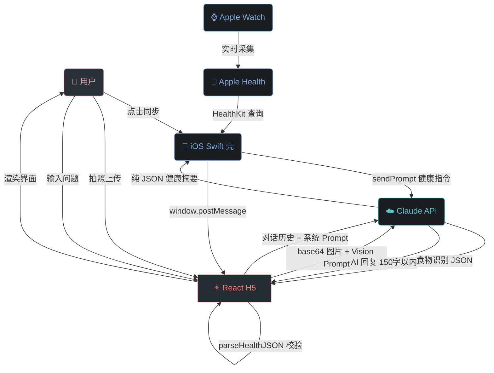
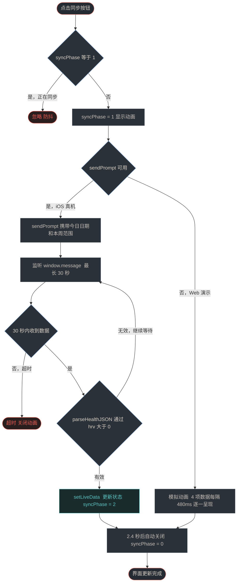
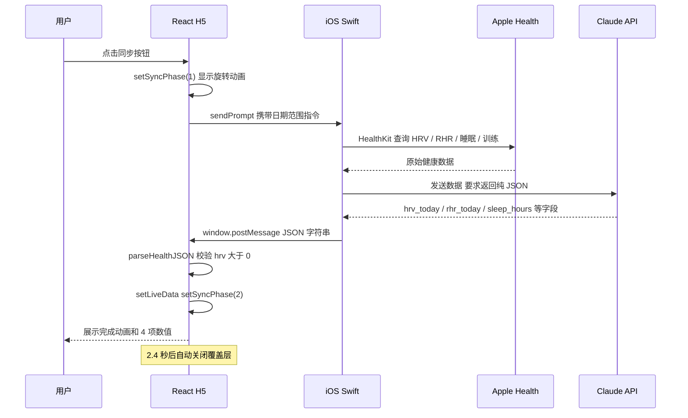
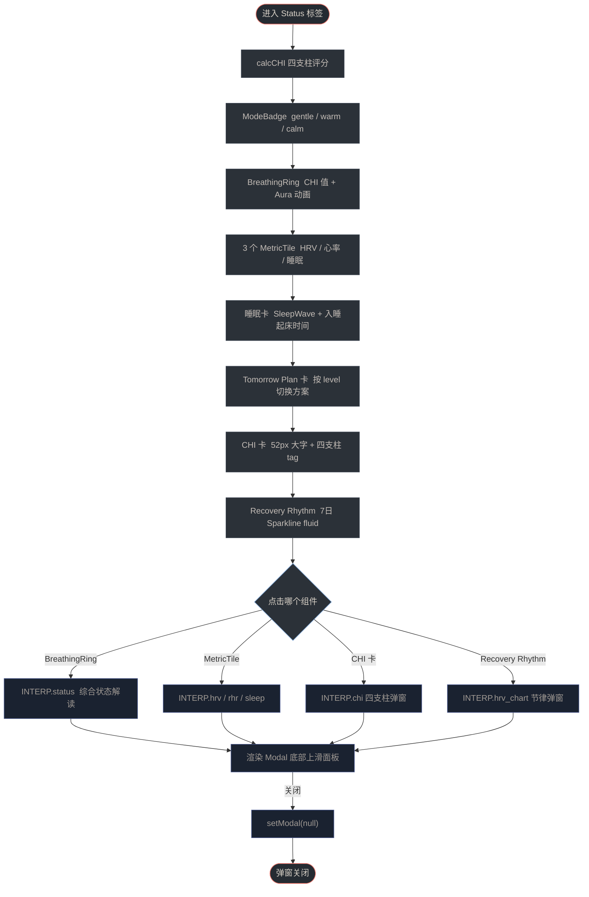
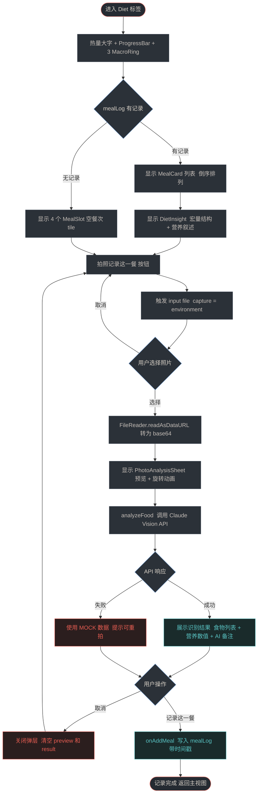
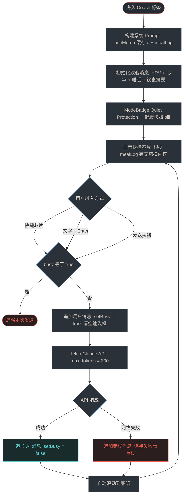
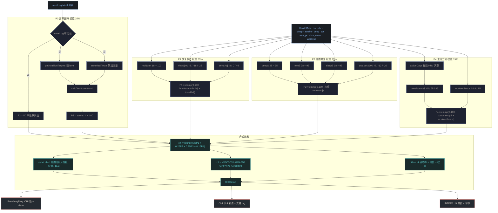
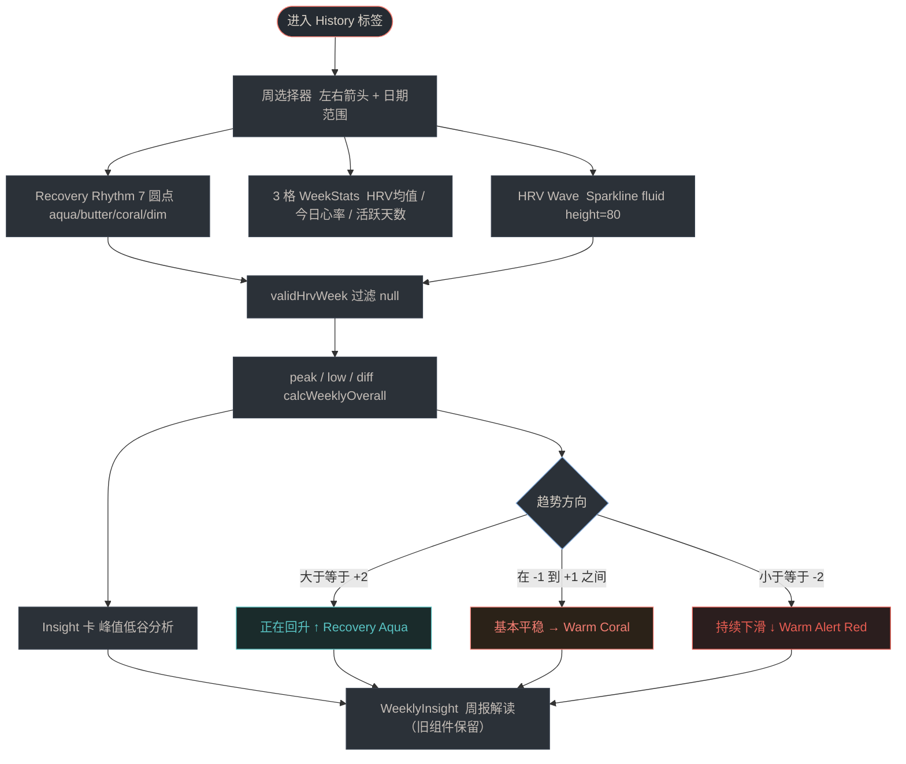
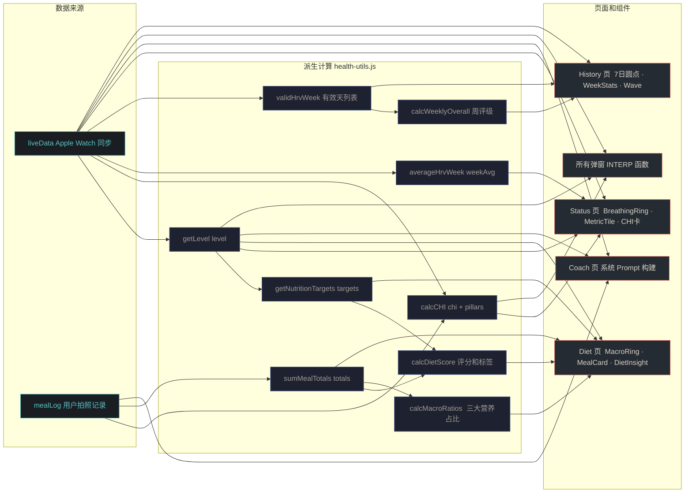

# Coach.AI 产品说明文档

**版本：** v1.2 · 2026年5月  
**主题：** Body State OS — 细胞智能健康操作系统  
**维护：** 本文档随产品迭代持续更新，以 `design/` 目录为准

---

## 目录

1. [产品定位与核心理念](#01-产品定位与核心理念)
2. [技术架构](#02-技术架构)
3. [数据结构定义](#03-数据结构定义)
4. [健康状态计算逻辑](#04-健康状态计算逻辑)
5. [界面结构与导航](#05-界面结构与导航)
6. [各页面详细说明](#06-各页面详细说明)
7. [数据同步动画流程](#07-数据同步动画流程)
8. [AI 食物识别流程](#08-ai-食物识别流程)
9. [VI 设计系统](#09-vi-设计系统)
10. [典型用户工作流程](#10-典型用户工作流程)
11. [解读内容库（INTERP）](#11-解读内容库interp)
12. [工具函数模块（health-utils.js）](#12-工具函数模块health-utilsjs)
13. [本地测试数据](#13-本地测试数据)
14. [版本记录](#14-版本记录)

---

## 01 产品定位与核心理念

### 1.1 产品定义

Coach.AI（教练.AI）是一款基于 AI 的个人身体状态操作系统（Body State OS），运行于 iOS WKWebView 内嵌 H5 页面，核心功能包括：

- 通过 Apple Watch 读取每日健康数据（HRV、静息心率、睡眠、训练）
- 基于 Claude AI 进行个性化解读、对话教练与饮食营养分析
- 计算细胞健康评分（CHI），综合呈现身体整体状态
- 指导用户在正确的时机做正确的事情——训练、休息、补充营养

### 1.2 产品灵魂

Coach.AI 不是数据仪表盘，而是一位懂你身体的教练。它遵循**反仪表盘**哲学——不把所有数据平铺展示，而是用三层渐进式揭示模型引导用户：

| 层级 | 名称 | 用户体验 | 对应界面 |
|------|------|----------|----------|
| 第一层 | 感受层 | 今天身体感觉怎么样？ | BreathingRing 呼吸环 + ModeBadge 状态标签 |
| 第二层 | 理解层 | 为什么是这个状态？ | 点击解读弹窗（各指标详解）|
| 第三层 | 行动层 | 今天我该怎么做？ | Tomorrow Plan 卡 + 营养页 + AI 对话 |

### 1.3 核心关注领域

产品聚焦于细胞水平的健康管理，帮助用户逐步改善顽固性健康问题：

- 体重管理与代谢改善
- 睡眠质量优化（深睡比例、REM 占比、觉醒次数）
- 慢性炎症与疼痛（通过营养指导抗炎）
- 心血管健康（HRV 趋势、静息心率基线）
- 激素与生殖健康（长期 HRV 均值趋势）

---

## 02 技术架构

### 2.1 整体架构

| 层级 | 技术 | 说明 |
|------|------|------|
| 前端 H5 | React 18 + Vite + JSX | 单文件组件，内联样式，无 CSS 文件依赖 |
| iOS 壳 | Swift + WKWebView | 原生容器加载 H5，提供 Apple Health 数据访问 |
| AI 服务 | Anthropic Claude API | `claude-sonnet-4-20250514`，用于对话教练和食物识别 |
| 数据计算 | `health-utils.js`（纯函数）| 全部计算逻辑独立模块，52 个单元测试，100% 覆盖 |
| 图标 | 内联 SVG（`SVG_ICONS`）| 不依赖字体文件，离线可用，WebView 兼容 |
| 字体 | **Inter**（Google Fonts）| 主字体，优雅运动感；DM Sans 作 fallback |

### 2.2 数据流向

```
Apple Watch → Apple Health → iOS Swift 读取
  → sendPrompt() → Claude AI 解析
  → window.postMessage → React 状态更新 → UI 渲染
```

数据传输采用 JSON 格式，通过 `window.postMessage` 在 iOS WKWebView 与 H5 之间通信。`parseHealthJSON()` 函数负责解析和校验数据有效性。

### 2.3 状态管理

应用使用 React 内置 `useState` / `useCallback` / `useMemo` 管理状态，无额外状态管理库：

| 状态变量 | 类型 | 用途 |
|----------|------|------|
| `liveData` | `HealthData` | 当前健康数据，默认为 `DEFAULT_DATA`（演示数据）|
| `mealLog` | `Meal[]` | 今日饮食记录列表，由用户拍照累积 |
| `tab` | `"status" \| "diet" \| "coach" \| "history"` | 当前激活的导航标签（v1.2 新命名）|
| `modal` | `object \| null` | 当前弹窗内容（null = 关闭）|
| `syncPhase` | `0 \| 1 \| 2` | 同步动画阶段：0 空闲 / 1 同步中 / 2 完成 |
| `syncItems` | `array` | 同步完成后展示的数据项列表 |

### 2.4 iOS ↔ H5 通信协议

同步按钮触发 `sendPrompt()`，携带标准提示词；iOS 端收到 Claude 回复后通过 `postMessage` 推回 H5。

**触发指令格式：**

```
COACH_AI_SYNC:请立即读取我的 Apple Watch 健康数据，今日 YYYY-MM-DD，本周 YYYY-MM-DD 到 YYYY-MM-DD。
只回复纯 JSON 不含其他任何文字：
{
  "hrv_today": 数值,
  "rhr_today": 数值,
  "sleep_hours": 数值,
  "sleep_awake_count": 数值,
  "deep_sleep_pct": 数值,
  "rem_sleep_pct": 数值,
  "hrv_week": [{"day": "M/D", "val": 数值}],
  "workout_today": {"type": "类型", "duration_min": 数值, "calories": 数值},
  "sync_time": "HH:MM"
}
```

H5 端监听 `message` 事件，检测 JSON 中是否包含 `hrv_today` 或 `"hrv"` 字段，有效时调用 `parseHealthJSON()` 解析并更新 `liveData`。

> **超时保护：** 30 秒后若未收到数据，自动关闭同步动画。

---

## 03 数据结构定义

### 3.1 HealthData 健康数据对象

| 字段 | 类型 | 说明 | 示例值 |
|------|------|------|--------|
| `hrv` | `number` | 今日 HRV（ms）| `54.2` |
| `rhr` | `number` | 静息心率（bpm）| `56` |
| `sleep` | `number` | 睡眠时长（小时）| `7.17` |
| `awake` | `number (int)` | 夜间觉醒次数 | `0` |
| `deep_pct` | `number` | 深睡比例（%）| `18` |
| `rem_pct` | `number` | REM 比例（%）| `22` |
| `sleep_start` | `string?` | 入睡时间 HH:MM（可选，fallback "23:00"）| `"23:00"` |
| `sleep_end` | `string?` | 起床时间 HH:MM（可选，fallback "06:30"）| `"06:30"` |
| `hrv_week` | `HRVDay[]` | 7天 HRV 数组 | 见 3.2 |
| `workout` | `Workout` | 今日训练记录 | 见 3.3 |
| `sync_time` | `string` | 同步时间 HH:MM | `"19:41"` |
| `sync_date` | `string` | 同步日期 M月D日 | `"5月9日"` |
| `is_stale` | `boolean` | 是否为旧/演示数据 | `false` |

### 3.2 HRVDay 单日 HRV 记录

| 字段 | 类型 | 说明 |
|------|------|------|
| `day` | `string` | 日期标签，格式 M/D，如 `5/8` |
| `val` | `number \| null` | HRV 值（ms）；`null` 表示当日无数据（未佩戴手表）|

### 3.3 Workout 训练记录

| 字段 | 类型 | 说明 |
|------|------|------|
| `type` | `string` | 训练类型，如「力量训练」「跑步」|
| `duration` | `number` | 训练时长（分钟）|
| `calories` | `number` | 消耗热量（kcal）|

### 3.4 Meal 饮食记录（用户打卡）

| 字段 | 类型 | 说明 |
|------|------|------|
| `id` | `number` | 唯一 ID，使用 `Date.now()` |
| `slot` | `"早餐" \| "午餐" \| "晚餐" \| "加餐"` | v1.2 新增餐次分类 |
| `time` | `string` | 记录时间 HH:MM |
| `photoUrl` | `string (DataURL)` | 拍照 base64 图片 URL |
| `foods` | `Food[]` | 识别到的食物列表 |
| `totals` | `MacroTotals` | 本餐宏量营养素合计 |
| `note` | `string` | AI 生成的一句话点评 |

### 3.5 MacroTotals 营养素合计

| 字段 | 类型 | 单位 |
|------|------|------|
| `calories` | `number` | kcal |
| `protein` | `number` | g |
| `carbs` | `number` | g |
| `fat` | `number` | g |

---

## 04 健康状态计算逻辑

### 4.1 综合恢复等级 `getLevel()`

根据 HRV、静息心率、睡眠时长、觉醒次数综合判定当日状态，返回 `green` / `yellow` / `red`。

| 指标 | 红灯条件 | 黄灯条件 | 绿灯 |
|------|----------|----------|------|
| HRV | < 48 ms → +1红 | 48–54 ms → +1黄 | ≥ 55 ms |
| 静息心率 | > 59 bpm → +1红 | 57–59 bpm → +1黄 | ≤ 56 bpm |
| 睡眠时长 | < 6.5 h → +1红 | 6.5–7.4 h → +1黄 | ≥ 7.5 h |
| 夜间觉醒 | — | ≥ 4次 → +1黄 | < 4次 |

**判断规则：** 红灯数 ≥ 1 或 黄灯数 ≥ 3 → 综合红灯；黄灯数 ≥ 1 → 综合黄灯；其余为绿灯。

### 4.2 HRV 颜色分类 `classifyHrvColor()`

| HRV 值 | 颜色名称 | 十六进制 | 含义 |
|--------|----------|----------|------|
| ≥ 55 ms | Recovery Aqua | `#59C3C3` | 绿灯，恢复良好 |
| 48–54 ms | Warm Coral | `#F27D72` | 黄灯，恢复尚可 |
| < 48 ms | Warm Alert Red | `#E85D52` | 红灯，恢复不足 |
| 无数据 (null) | Midnight Fog | `#39424F` | 无数据 |

### 4.3 细胞健康评分 `calcCHI()`

CHI（Cellular Health Index）是 0–100 分的综合细胞健康状态评分，由四个支柱加权计算：

```
CHI = 0.35 × P1（恢复状态）
    + 0.25 × P2（细胞修复）
    + 0.25 × P3（营养支持）
    + 0.15 × P4（生活方式）
```

#### P1 — 恢复状态（权重 35%）

| HRV 区间 | 基础分 (hrvNorm) |
|----------|-----------------|
| ≥ 65 ms | 100 |
| 55–64 ms | 82 |
| 48–54 ms | 60 |
| 42–47 ms | 38 |
| < 42 ms | 18 |

- **静息心率调整（rhrAdj）：** ≤ 56 → 0；57–59 → -8；60–62 → -18；> 62 → -28
- **趋势调整（trendAdj）：** 今日 HRV ≥ 周均值 +3 → +8；≤ 周均值 -5 → -8；其余 → 0
- `P1 = max(0, min(100, hrvNorm + rhrAdj + trendAdj))`

#### P2 — 细胞修复质量（权重 25%）

| 深睡比例 | deepS | REM 比例 | remS | 睡眠时长 | sleepS |
|----------|-------|----------|------|----------|--------|
| ≥ 20% | 95 | ≥ 22% | 95 | ≥ 7.5h | 95 |
| 16–19% | 78 | 18–21% | 78 | 7–7.4h | 82 |
| 12–15% | 55 | 14–17% | 55 | 6.5–6.9h | 62 |
| < 12% | 28 | < 14% | 28 | 6–6.4h | 38 |
| — | — | — | — | < 6h | 18 |

- **觉醒调整（awakeAdj）：** 0–1次 → 0；2次 → -5；3次 → -12；≥ 4次 → -20
- `P2 = max(0, min(100, (deepS + remS + sleepS) / 3 + awakeAdj))`

#### P3 — 营养支持（权重 25%）

- 无饮食打卡记录时，P3 默认取中性值 **50 分**
- 有记录时：按当日恢复等级确定营养目标（见 4.5），计算饮食评分 `calcDietScore()`，`P3 = round(score / 4 × 100)`

#### P4 — 生活方式一致性（权重 15%）

- **基础分（consistencyS）：** 本周有效 HRV 天数 ≥ 5天 → 85；≥ 3天 → 65；否则 45
- **训练加成（workoutBonus）：** 今日训练 ≥ 30分钟 → +15；> 0分钟 → +8；否则 0
- `P4 = max(0, min(100, consistencyS + workoutBonus))`

#### CHI 状态等级

| CHI 分值 | 状态名称 | 颜色 | 含义 |
|----------|----------|------|------|
| ≥ 75 | 细胞活跃 | `#59C3C3` Recovery Aqua | 细胞处于良好工作环境 |
| 55–74 | 细胞维稳 | `#7DA7D9` Aerobic Blue | 整体平稳，有改善空间 |
| 40–54 | 细胞应激 | `#F27D72` Warm Coral | 消耗 > 补充，需要支持 |
| < 40 | 细胞耗竭 | `#E85D52` Warm Alert Red | 身体需要被关注和补充 |

### 4.4 本周整体 HRV 评级 `calcWeeklyOverall()`

统计绿灯（≥ 55 ms）、黄灯（48–54 ms）、红灯（< 48 ms）天数：

- 绿灯天数 ≥ 4 → **良好**（`#59C3C3`）
- 绿灯天数 ≥ 2 → **中等**（`#F27D72`）
- 其余 → **需关注**（`#E85D52`）

### 4.5 营养目标 `getNutritionTargets()`

| 恢复等级 | 热量目标 | 蛋白质 | 碳水 | 脂肪 |
|----------|----------|--------|------|------|
| green（训练日）| 2000 kcal | 140 g | 200 g | 60 g |
| yellow（恢复日）| 2000 kcal | 130 g | 200 g | 60 g |
| red（休息日）| 2000 kcal | 120 g | 200 g | 60 g |

### 4.6 饮食评分 `calcDietScore()`

对照当日目标评估四项指标，每项达标得 1 分，总分 0–4：

| 指标 | 达标条件 | 变量名 |
|------|----------|--------|
| 蛋白质 | ≥ 目标 × 70% | `proOk` |
| 碳水 | ≤ 目标 | `carbOk` |
| 脂肪 | ≤ 目标 | `fatOk` |
| 热量 | 在目标 50%–110% 区间内 | `calOk` |

- 3–4分 → **均衡**（`#59C3C3`）
- 2分 → **基本合理**（`#F27D72`）
- 0–1分 → **需调整**（`#E85D52`）

---

## 05 界面结构与导航

### 5.1 AppHeader（v1.2 全新）

顶部固定导航栏，包含：

| 区域 | 内容 | 说明 |
|------|------|------|
| 左侧 Logo | SVG 环形图 + EKG 线 + Butter 圆点 + "Coach.AI" 字样 | 品牌标识，非文字 icon |
| 中部 | 今日日期 + 星期几 | `THURSDAY · MAY 15` 格式 |
| 右侧 | 圆形同步按钮 | 旋转动画，同步中禁用；右下角绿点=已同步 |

容器宽度上限 **480px**（v1.0 为 680px），匹配手机视口。

### 5.2 BottomNav（v1.2 全新）

底部玻璃态胶囊导航，4个标签，每个标签有专属情绪色：

| 标签 ID | 中文名 | 图标 | 激活色 |
|---------|--------|------|--------|
| `status` | 状态 | `ti-activity` | Recovery Aqua `#59C3C3` |
| `diet` | 补给 | `ti-salad` | Butter Energy `#F4D35E` |
| `coach` | AI | `ti-message-circle` | Dust Rose `#D9A5B3` |
| `history` | 节律 | `ti-chart-line` | Aerobic Blue `#7DA7D9` |

> v1.0 旧 tab ID：`dashboard` / `checkin` / `coach` / `history`  
> v1.2 新 tab ID：`status` / `diet` / `coach` / `history`

### 5.3 弹窗系统（Modal）

全屏半透明遮罩 + 底部上滑面板，面板最大高度 76%，内容超出时自动滚动。

**弹窗结构：** 把手条 → 头部（图标 + 标题 + 关闭按钮）→ 彩色分割线 → 内容块列表 → 底部提示

**关闭方式：** 点击遮罩 / 点击关闭按钮 / 按 Escape 键（PC 调试）

---

## 06 各页面详细说明

### 6.1 状态页（StatusPage） — v1.2 全新重写

取代旧版 `dashboard`，采用「Luxury Athletic OS」视觉语言：

#### 6.1.1 ModeBadge 模式标签

基于 CHI 分值驱动三种呼吸模式：

| CHI 分值 | Mode | 颜色 | 标签文字 |
|----------|------|------|----------|
| < 50 | `gentle` | Warm Coral | Gentle Awareness |
| 50–69 | `warm` | Recovery Aqua | Warm Breathing |
| ≥ 70 | `calm` | Recovery Aqua | Calm Energy |

左侧带呼吸动效圆点（`breathDot` 动画），文字颜色与点颜色一致。

#### 6.1.2 BreathingRing 呼吸环（主 Hero 组件）

- 直径 236px，SVG 弧形进度环（0–100 分）
- 外层径向渐变 Aura 光晕（`breathAura` 动画，2.8s loop）
- 中心显示 CHI 分值（大字）+ 恢复状态（副标签）
- `RECOVERY` 英文标签（小号，字间距 0.22em）
- 点击触发 `status` 弹窗解读

#### 6.1.3 MetricTile 三列指标块

3个横排小卡片，每卡包含：
- 指标标签（小写字母，全大写）
- 数值 + 单位（tabular-nums 等宽字体）
- 迷你 Sparkline 折线（`trend` prop 传入历史数组）

| 指标 | 数据来源 | 颜色 |
|------|----------|------|
| HRV | `d.hrv`（过滤 null）| Recovery Aqua |
| 心率 | `d.rhr` | Warm Coral |
| 睡眠 | `d.sleep` | Dust Rose |

#### 6.1.4 睡眠卡（Sleep Card）

- 顶部：深睡分钟数大字（fontWeight 250）
- 中部：`SleepWave` SVG 正弦波曲线（Dust Rose 渐变填充）
- 底部：入睡时间 / 总时长 / 醒来时间（使用 `sleep_start` / `sleep_end` 字段，fallback "23:00"/"06:30"）

#### 6.1.5 Tomorrow Plan 卡

按恢复等级（`getLevel(d)`）显示明日训练建议：

| 等级 | 训练名称 | 时长 | 区间 | 颜色 |
|------|----------|------|------|------|
| green | 上肢力量 | 45 min | Zone 3 | Aerobic Blue |
| yellow | 轻量有氧 | 35 min | Zone 2 | Aerobic Blue |
| red | 主动恢复 | 20 min | 拉伸 | Dust Rose |

#### 6.1.6 CHI 卡

- 52px 大字显示 CHI 分值（fontWeight 250，tabular-nums）
- 4个彩色圆点代表四支柱评分（颜色随各支柱分值动态变化）
- 4个药丸 tag 显示各支柱名称 + 分值
- 点击触发 `chi` 弹窗解读

#### 6.1.7 Recovery Rhythm 卡（HRV 7日 Sparkline）

- Catmull-Rom 平滑曲线，`fluid` 模式（width="100%"）自适应容器宽度
- null 值绘制为中间高度的缺口段

### 6.2 补给页（DietPage / FoodCheckinPage）— v1.2 重写

#### 视觉变化

- ModeBadge：Butter 色系 "Nourishment"
- 96px 热量大字（fontWeight 250）+ ProgressBar 进度条
- 3个 MacroRing（蛋白质/碳水/脂肪）圆形进度环，grid 布局
- 照片 CTA 卡片：Butter 渐变背景 + 相机图标
- 4个 MealSlot 空餐次 tile（早餐/午餐/晚餐/加餐）

#### 功能保持不变

1. 点击「拍照记录这一餐」→ 触发 `input[type=file, capture=environment]`
2. Claude Vision API 识别食物营养
3. `PhotoAnalysisSheet` 展示识别结果
4. 点击记录 → 写入 `mealLog`
5. `MealCard` 展示历史记录，支持展开/删除
6. `DietInsight` 营养解读

### 6.3 AI 教练页（CoachPage）— v1.2 重写

#### 新视觉组件

| 组件 | 描述 |
|------|------|
| `AIAvatar` | 64px 圆形头像，Aerobic Blue 渐变 + 白色 AI 字母 |
| `ChatMessage` | AI 消息：`rgba(216,209,199,0.04)` 毛玻璃卡；用户消息：aqua 渐变 |
| `TypingBubble` | 三点 `tdot` 动画（三点依次上下，错位 delay）|
| 快捷芯片 | 横向滚动 rail，点击直接发送预设问题 |
| 发送按钮 | 36px 圆形 aqua 渐变 + 箭头图标 |

#### 实时健康快照 pill

对话框顶部显示当前 HRV / 心率 / 睡眠三元素 pill，ModeBadge "Quiet Protection"（Dust Rose）。

#### 功能保持不变

- 系统 Prompt 包含今日 HRV / 心率 / 睡眠 / 训练数据 + 饮食记录摘要
- Claude 模型 `claude-sonnet-4-20250514`，max_tokens 300
- 快捷芯片根据 mealLog 有无动态切换

### 6.4 节律历史页（HistoryPage）— v1.2 重写

#### 新布局结构

| 区块 | 内容 |
|------|------|
| 周选择器 | 左右箭头按钮 + "本周恢复" + 日期范围（目前仅展示，无跨周导航数据）|
| Recovery Rhythm 卡 | 7个圆形日历点（颜色 aqua/butter/coral/dim）+ 图例 |
| 三列 WeekStats | HRV 均值（`wa`）/ **今日心率**（`d.rhr`）/ **活跃天数**（`valid.length`）|
| HRV Wave 卡 | Sparkline fluid 折线，height=80 |
| Insight 卡 | 峰值/低谷分析，HRV 波动 diff 文字 |

> v1.1 → v1.2 修复：原"心率均值=57"和"训练次数=5"均为硬编码占位值，v1.2 改为 `d.rhr`（今日心率）和 `valid.length`（本周有效天数）

**注意：** 旧 `WeeklyInsight` 组件（复杂的周报解读）仍保留在代码中，渲染于 Insight 卡之后。

---

## 07 数据同步动画流程

### 7.1 同步状态机

| 阶段（syncPhase）| 视觉状态 | 触发条件 | 持续时间 |
|-----------------|----------|----------|----------|
| 0（空闲）| AppHeader 显示「等待同步」或上次同步时间 | 初始 / 超时 / 完成后 | — |
| 1（同步中）| 覆盖层显示旋转环 + 骨架屏占位 | 点击同步按钮 | 直到数据到达（最长30秒）|
| 2（完成）| 覆盖层显示绿色勾 + 4项数据值列表 | postMessage 收到有效数据 | 2.4秒后自动关闭 |

### 7.2 SyncOverlay 组件动效

- **同步中：** 橙色脉冲环动画（`ringPulse`）+ 旋转进度环 + 骨架屏（`shimmer`）
- **完成：** 颜色从 Warm Coral → Recovery Aqua（400ms transition）+ 勾号弹出（`popIn`）
- **数据项卡片：** `itemSlide` 逐个进入动画

> **降级处理：** `sendPrompt` 不可用时，模拟动画演示，数据项以 480ms 间隔依次呈现，总时长约 3.5 秒。

---

## 08 AI 食物识别流程

### 8.1 识别调用

`analyzeFood(base64, mimeType)` 向 Claude `claude-sonnet-4-20250514` 发送图片（Vision 模式），要求返回纯 JSON：

```json
{
  "foods": [
    {
      "name": "食物名",
      "emoji": "🍗",
      "amount": "约100g",
      "calories": 200,
      "protein": 25,
      "carbs": 5,
      "fat": 8
    }
  ],
  "totals": { "calories": 200, "protein": 25, "carbs": 5, "fat": 8 },
  "note": "一句话简评，包含营养建议"
}
```

解析结果时通过正则提取 JSON 对象（`text.match(/\{[\s\S]*\}/)`），容错 API 返回多余文字的情况。

### 8.2 降级处理

- API 请求失败或返回非法 JSON 时，使用内置 MOCK 数据（米饭 + 清蒸鱼 + 炒青菜示例）保证用户流程不中断
- 识别失败时（`result.error`）确认按钮置灰，提示「识别暂未成功，请手动添加或重新拍照」

---

## 09 VI 设计系统

### 9.1 设计主题

**「Luxury Athletic OS」— Warm Technology · Soft Athletic Futurism**

> **设计哲学：** 情绪即材料（Emotion as Material）——颜色传达身体状态，而非装饰。  
> **动效哲学：** 动效像：呼吸 · 心率 · 水波 · 肌肉放松 · 空气流动

### 9.2 色彩 Token 系统（v1.2 全量更新）

#### 背景层（Dark Base）

| Token | 颜色名称 | 十六进制 | 用途 |
|-------|----------|----------|------|
| `mineral` | Mineral Graphite | `#1F2328` | 主背景色（替换旧 `ink`）|
| `carbon` | Soft Carbon | `#2B3138` | 卡片底色（替换旧 `ink2`）|
| `midnight` | Midnight Fog | `#39424F` | 边框 / 分割线（替换旧 `ink3`）|
| `cardBg` | — | `rgba(216,209,199,0.04)` | Card 背景（毛玻璃感）|
| `cardBgWarm` | — | `rgba(216,209,199,0.06)` | Card warm 变体 |
| `border` | — | `rgba(216,209,199,0.09)` | 默认边框 |
| `borderStrong` | — | `rgba(216,209,199,0.16)` | 强调边框 |

#### 文字层

| Token | 用途 | 十六进制 |
|-------|------|----------|
| `text` | 主文字 | `#F2EDE5` |
| `textSec` | 次要文字 | `rgba(242,237,229,0.62)` |
| `textTer` | 三级文字 | `rgba(242,237,229,0.38)` |
| `textDim` | 极暗辅助 | `rgba(242,237,229,0.20)` |

#### 语义色（情绪能量色）

| 颜色名称 | 十六进制 | Soft 变体 | 含义 | 使用场景 |
|----------|----------|-----------|------|----------|
| Recovery Aqua | `#59C3C3` | `rgba(89,195,195,0.14)` | 恢复良好 / 绿灯 | HRV ≥ 55 / CHI ≥ 75 / Status Tab |
| Aerobic Blue | `#7DA7D9` | `rgba(125,167,217,0.14)` | Zone 2 有氧 / CHI 维稳 | History Tab / AI 对话 |
| Warm Coral | `#F27D72` | `rgba(242,125,114,0.14)` | 注意 / 降低强度 | HRV 黄灯 / CHI 40–54 |
| Butter Energy | `#F4D35E` | `rgba(244,211,94,0.16)` | 活力 / 营养 | Diet Tab / 成就系统 |
| Dust Rose | `#D9A5B3` | `rgba(217,165,179,0.14)` | 睡眠 / 恢复 / Coach | Coach Tab / 睡眠卡 |
| Warm Alert Red | `#E85D52` | — | 警告 / 强制休息 | HRV 红灯 / CHI < 40 |

### 9.3 字体规范（v1.2 更新）

**主字体：** `Inter`（Google Fonts，300/400/500/600/700）  
**备用：** `DM Sans`（Google Fonts）→ 系统 `sans-serif`

```css
@import url('https://fonts.googleapis.com/css2?family=Inter:wght@300;400;500;600;700&display=swap');
font-family: 'Inter', 'DM Sans', sans-serif;
```

**数字显示规范：** 所有数值使用 `fontVariantNumeric: "tabular-nums"` 等宽字体，避免数字跳动。

### 9.4 Card 组件

```jsx
// 软质感材料卡片
backdropFilter: "blur(20px) saturate(140%)"
background: rgba(216,209,199,0.04)  // cardBg
border: rgba(216,209,199,0.09)       // border
borderRadius: 24px
```

| Prop | 说明 |
|------|------|
| `pad` | 内边距（默认 20）|
| `warm` | 开启 cardBgWarm（稍亮）|
| `accent` | 传入颜色值，叠加彩色边框光晕 |
| `onClick` | 传入时显示点击态（opacity 0.8）|

### 9.5 动效系统（v1.2 新增）

| 动效名 | `@keyframes` | 时长 | 用途 |
|--------|-------------|------|------|
| `breathe` | scale(.7) → scale(1.4) | 2s infinite | 状态圆点呼吸感 |
| `breathDot` | scale(.7)→scale(1.3) + opacity | 2s infinite | **新** ModeBadge 呼吸点 |
| `breathAura` | scale(.95)→scale(1.08) + opacity | 3.2s infinite | **新** BreathingRing 外层 Aura |
| `tdot` | translateY(0)→-4px + opacity | 1.2s infinite | **新** TypingBubble 三点动画（错位 delay）|
| `screenFade` | opacity+translateY(6px)→0 | 0.3s | **新** 页面切换淡入 |
| `ringPulse` | scale(1) → scale(1.14) | 1.6s infinite | 同步动画外环脉冲 |
| `slideUp` | translateY(56px) → 0 | 0.32s | 弹窗从底部滑出 |
| `spin` | rotate(360deg) | 1.2s linear | 同步旋转环 / AI 识别转圈 |
| `bop` | translateY(0) → -4px → 0 | 1.2s infinite | AI 等待三点动画（旧版）|
| `shimmer` | translateX(-100%) → 100% | 1.4s infinite | 骨架屏流光效果 |
| `itemSlide` | translateX(-10px) → 0 | 0.38s | 同步数据项滑入 |
| `popIn` | scale(.5) → 1 | 0.3s | 完成勾号弹出 |

### 9.6 Sparkline 组件（v1.2 更新）

Catmull-Rom 平滑贝塞尔曲线，替代旧 `<polyline>` 折线：

```jsx
<Sparkline
  data={values}      // number | null 数组，null 绘制为中间高度
  color={C.aqua}     // 线条 + 渐变填充颜色
  width={300}        // 坐标系宽度（viewBox 内部）
  height={60}        // 高度（px）
  fluid={true}       // 新增：width="100%" 自适应容器，preserveAspectRatio="none"
/>
```

---

## 10 典型用户工作流程

### 10.1 每日核心流程

| 步骤 | 用户行为 | 系统响应 | 涉及组件 |
|------|----------|----------|----------|
| 1 | 早晨打开应用 | 展示演示数据（`is_stale=true`，AppHeader 无绿点）| `AppHeader` |
| 2 | 点击圆形同步按钮 | 触发 `sendPrompt`，显示同步动画覆盖层 | `SyncOverlay` / `doSync()` |
| 3 | 收到 Apple Health 数据 | 2.4秒动画后，UI 更新为今日真实数据 | `parseHealthJSON` |
| 4 | 查看 Status 页 | BreathingRing + ModeBadge + MetricTile 综合展示 | `StatusPage` |
| 5 | 点击 BreathingRing | 弹窗：综合评级依据 / 当前状态含义 / 建议行动 | `Modal` / `INTERP.status` |
| 6 | 查看 CHI 卡 | 弹窗：CHI 说明 / 今日状态解读 / 四项支柱 | `INTERP.chi` |
| 7 | 切换到 Diet 页 | Butter 色系 / 热量 / 三环宏量展示 | `FoodCheckinPage` |
| 8 | 午餐后拍照打卡 | AI 识别食物营养，累积到 `mealLog` | `analyzeFood` |
| 9 | 切换到 Coach 页 | AI 对话，基于今日全部数据个性化响应 | `CoachPage` |
| 10 | 切换到 History 页 | 7日 HRV 圆形日历 + 节律分析 | `HistoryPage` |

### 10.2 数据驱动联动关系

- **`liveData`** → 驱动所有页展示：BreathingRing 分值、MetricTile 数值、弹窗内容
- **`mealLog`** → 影响 DietPage、DietInsight、CHI 中的 P3 营养支持分、AI 对话 Prompt
- **`level`** → 影响 Tomorrow Plan、营养目标、DietInsight 建议文本
- **`calcCHI(d, mealLog)`** → 每次渲染时实时计算，驱动 BreathingRing + CHI 卡 + 弹窗

---

## 11 解读内容库（INTERP）

所有弹窗内容由 `INTERP` 对象统一管理，每个 key 对应一个函数：

| Key | 函数签名 | 弹窗主题 | 包含章节 |
|-----|----------|----------|----------|
| `status` | `INTERP.status(d, level)` | 综合状态评级 | 综合评级依据 / 当前状态含义 / 建议行动 |
| `hrv` | `INTERP.hrv(d)` | 心率变异性（HRV）| 当前读数 / HRV 是什么 / 你的参考基准 / 阈值速查 |
| `rhr` | `INTERP.rhr(d)` | 静息心率（RHR）| 当前读数 / 你的个人基准 / 近期趋势 |
| `sleep` | `INTERP.sleep(d)` | 睡眠分析 | 今晚概况 / 各阶段意义 / 对今日训练的影响 |
| `workout` | `INTERP.workout(d)` | 今日训练记录 | 训练概览 / 负荷评估 / 对明日的影响 |
| `rec` | `INTERP.rec(level)` | 明日训练建议 | 推荐方案 / 心率区间说明 / 特别提示 |
| `nutrition` | `INTERP.nutrition(d, level)` | 补给方案解读 | 今日模式 / 蛋白质策略 / 补充时机 / 抗炎食物 |
| `hrv_chart` | `INTERP.hrv_chart(d)` | 恢复节律趋势 | 本周走势 / 为何会波动 / 长期改善目标 |
| `chi` | `INTERP.chi(chiData)` | 细胞健康评分 | 什么是CHI / 今日状态 / 四项支柱评分 / 今日关注 |

---

## 12 工具函数模块（health-utils.js）

所有业务计算逻辑集中在 `health-utils.js`，纯函数设计，**52 个单元测试**，100% 覆盖（Vitest）。

| 函数名 | 输入 | 输出 | 说明 |
|--------|------|------|------|
| `toFiniteNumber(value, fallback)` | `any, number` | `number` | 安全数字转换，非有限数返回 fallback |
| `parseOptionalNumber(value)` | `any` | `number \| null` | 可选数字，无效返回 null |
| `normalizeWorkout(workout)` | `object` | `Workout` | 兼容 `duration_min` / `duration`；`duration_min` 优先 |
| `normalizeHrvWeek(week)` | `array` | `HRVDay[]` | 规范化7天 HRV 数组，无效值转 null |
| `validHrvWeek(week)` | `HRVDay[]` | `HRVDay[]` | 过滤 null，仅保留有效天 |
| `averageHrvWeek(week)` | `HRVDay[]` | `number` | 有效天的 HRV 均值 |
| `parseHealthJSON(raw, now)` | `string \| object` | `HealthData \| null` | 解析 Claude 回传的健康 JSON |
| `getLevel(d)` | `HealthData` | `"green" \| "yellow" \| "red"` | 综合恢复等级 |
| `classifyHrvColor(val)` | `number \| null` | `string (hex)` | HRV 值 → VI 调色板颜色 |
| `calcCHI(d, mealLog)` | `HealthData, Meal[]` | `CHIResult` | 四维度 CHI 综合评分 |
| `calcWeeklyOverall(validWeek)` | `HRVDay[]` | `WeeklyOverall` | 本周整体 HRV 评级 |
| `sumMealTotals(mealLog)` | `Meal[]` | `MacroTotals` | 累加全天营养素 |
| `getNutritionTargets(level)` | `string` | `MacroTargets` | 按恢复等级获取营养目标 |
| `calcDietScore(totals, targets)` | `MacroTotals, MacroTargets` | `DietScore` | 饮食评分 0–4 |
| `calcMacroRatios(totals)` | `MacroTotals` | `MacroRatios` | 宏量热量百分比（pPct+cPct+fPct=100）|

---

## 13 本地测试数据

### 13.1 文件结构

```
h5/test-data/
├── CoachAI_SourceData_v1.2.xlsx   # 10个场景的完整数据表（Excel）
└── mock-data.js                    # JS 测试数据，可直接 import 使用
```

### 13.2 Excel 工作表说明

| Sheet | 内容 |
|-------|------|
| 测试场景 Scenarios | 10 行 × 16 列，每行一个完整快照 |
| 7日HRV趋势 HRV_Week | 每个场景对应一组 7 天 HRV 曲线 |
| 饮食记录 Meals | 21 条餐次记录，可按场景 ID 组合 |
| 使用说明 ReadMe | 字段说明与使用指引 |

### 13.3 10 个测试场景设计

| 场景 ID | 名称 | level | HRV | CHI 目标 |
|---------|------|-------|-----|----------|
| S01 | 绿灯·最佳训练日 | green | 64.8 ms | ≥ 78 |
| S02 | 绿灯·有氧日 | green | 58.5 ms | 65–75 |
| S03 | 绿灯·休息日 | green | 66.2 ms | ≥ 80 |
| S04 | 黄灯·训练后疲劳 | yellow | 51.3 ms | 50–62 |
| S05 | 黄灯·睡眠偏少 | yellow | 55.8 ms | 52–60 |
| S06 | 黄灯·心率偏高 | yellow | 53.2 ms | 48–58 |
| S07 | 红灯·过度训练 | red | 43.7 ms | ≤ 35 |
| S08 | 红灯·严重睡眠不足 | red | 46.2 ms | ≤ 30 |
| S09 | 红灯·全维度偏低 | red | 41.0 ms | ≤ 28 |
| S10 | 恢复中·V型反弹 | yellow | 54.1 ms | 48–58 |

### 13.4 快速切换测试场景

```js
// health-utils.js 顶部——切换为红灯场景测试
import { loadScenario } from "./test-data/mock-data.js";
export const DEFAULT_DATA = loadScenario("S07");

// App() 中预填饮食记录
import { getMockMeals } from "./test-data/mock-data.js";
const [mealLog, setMealLog] = useState(getMockMeals("S01"));
```

---

## 14 版本记录

| 版本 | 日期 | 主要变更 |
|------|------|----------|
| v0.1 | 2025年4月 | iOS Swift 壳 + H5 基础骨架，Apple Health 数据读取原型 |
| v0.5 | 2025年5月初 | 今日主页完整实现：状态主环、四格指标卡、睡眠卡、HRV 趋势、训练建议 |
| v0.7 | 2025年5月中 | 饮食打卡页（拍照 + Claude Vision 识别）+ AI 对话教练页 |
| v0.8 | 2025年5月中 | 历史节律页 + 本周解读模块 + `WeeklyInsight` |
| v0.9 | 2025年5月下 | VI 设计系统全面升级（Luxury Athletic OS）+ 对比度锚定 v1.1 |
| v1.0 | 2025年5月 | CHI 集成 + CHI 弹窗解读 + VI 设计规范 + 产品说明文档 v1.0 |
| v1.1 | 2026年4月 | Mermaid 流程图全面修复（Appendix A）|
| **v1.2** | **2026年5月** | **全面 UI 重写（Luxury Athletic OS Claude Design 落地）** |

### v1.2 详细变更

#### 新功能
- `AppHeader`：SVG Coach.AI Logo（环形 + EKG + Butter 点）+ 圆形同步按钮
- `BottomNav`：玻璃态胶囊，四 Tab 专属情绪色
- `StatusPage`：BreathingRing + ModeBadge + MetricTile + SleepWave + Tomorrow Plan + CHI 卡
- `BreathingRing`：236px SVG 弧形 + breathAura 外层光晕动画
- `ModeBadge`：gentle/warm/calm 三种模式，breathDot 呼吸点
- `MetricTile`：三列 HRV/心率/睡眠快览，含 Sparkline 迷你图
- `SleepWave`：正弦波 SVG 睡眠可视化
- `AIAvatar` + `TypingBubble`（tdot 动画）+ `ChatMessage` 双气泡
- `Sparkline` 新增 `fluid` 模式（width="100%"自适应）
- 本地测试数据：10 场景 Excel + `mock-data.js`

#### Bug 修复
- **HistoryPage 硬编码值**：心率均值 57→`d.rhr`，训练次数 5→`valid.length`（活跃天数）
- **Sparkline null 处理**：增加 `fluid` prop，响应式宽度；null 值绘制中间高度缺口
- **Sparkline 渐变 ID**：防止同色多实例 ID 冲突（加入 width 作区分因子）

#### 字体 / 动效
- 主字体从 DM Sans → **Inter**
- 新增：`breathDot` / `breathAura` / `tdot` / `screenFade` 动画

#### 测试
- 单元测试从 38 个 → **52 个**
- 新增覆盖：`calcCHI` / `parseOptionalNumber` / `normalizeWorkout`

#### 导航重命名
- `dashboard` → `status`
- `checkin` → `diet`

### 后续迭代计划

- [ ] 本地数据持久化（`mealLog` 跨会话保存，IndexedDB 或 iOS UserDefaults）
- [ ] 历史多周数据对比与长期 HRV 趋势图（当前仅支持本周）
- [ ] 成就系统与连续打卡 streak（Butter Energy 颜色体系）
- [ ] 个人基准设定页面（静息心率基准、体重、目标等）
- [ ] 苹果健康数据自动后台同步（无需手动点击同步按钮）
- [ ] 睡眠阶段详细分析（按小时展示，而非仅比例）
- [ ] 通知提醒（训练窗口提示、补餐提醒）
- [ ] HistoryPage 真实多周数据导航（当前周选择器仅展示，无数据切换）

---

## 附录 A  完整流程说明

本附录对每个核心模块分别绘制**操作流**（用户与界面的交互路径）和**数据流**（数据在系统内部的流转与变换），两种视角结合，完整描述系统行为。

**图例约定（所有流程图统一）**

| 形状 | 含义 | 颜色语义 |
|------|------|----------|
| 胶囊 `([...])` | 开始 / 结束节点 | Warm Coral 边框 |
| 矩形 `[...]` | 操作 / 处理步骤 | 中性深色背景 |
| 菱形 `{...}` | 判断 / 分支条件 | Aerobic Blue 边框 |
| 圆角矩形 `(...)` | 外部系统 | Deep Indigo 边框 |
| 深绿节点 | 成功 / 正向路径 | Recovery Aqua |
| 深红节点 | 警告 / 降级路径 | Warm Alert Red |

---

### A.1  系统整体架构流



---

### A.2  数据同步模块

#### 操作流



#### 数据流



---

### A.3  状态页模块（v1.2 重写）

#### 操作流



---

### A.4  饮食打卡模块

#### 操作流



---

### A.5  AI 教练对话模块

#### 操作流



---

### A.6  CHI 计算模块



---

### A.7  节律历史模块



---

### A.8  模块间数据依赖总览



---

*© 2026 Coach.AI · 保密文件，请勿外传*
